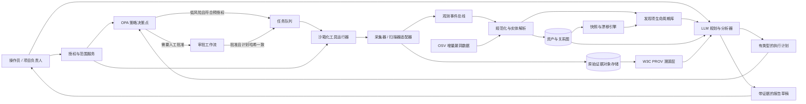
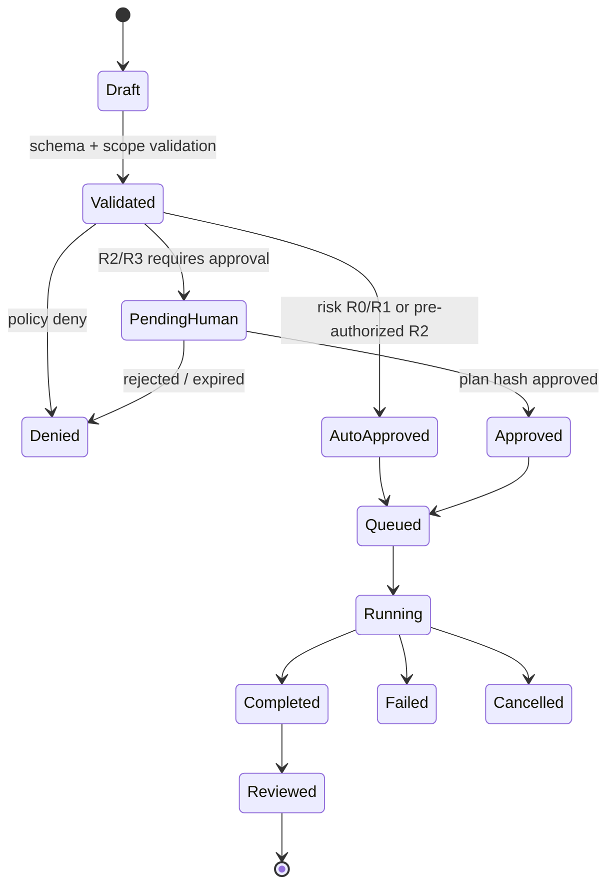

【1】

# AI驱动攻击面管理与安全自动化工具链检索报告

> 本报告基于以下查询进行检索，优先采信官方文档、标准组织与项目仓库来源。

## 一、AI驱动攻击面管理（ASM）开源架构

### 1. OASM（Open Attack Surface Management）

OASM是一个AI驱动的开源攻击面管理平台，采用分布式架构设计。其核心架构组件包括：

- **Web控制台**：基于React（Vite + TanStack Query/Router），用于用户交互、资产管理和实时监控
- **NestJS核心API服务**：负责业务逻辑、数据持久化和任务编排
- **Redis队列与缓存层**（BullMQ）：支持异步任务分发、速率限制和系统解耦
- **分布式Go Worker**：通过gRPC执行高性能扫描任务，支持水平自动扩缩容和容错
- **PostgreSQL数据库**（含pgvector扩展）：持久化存储资产、扫描结果和系统状态
- **Rustfs（S3兼容）对象存储**：存储扫描产物和报告
- **MCP（Model Context Protocol）服务器**：为AI系统提供结构化上下文
- **AI/LLM组件集成**（AI SDK、LangGraph）：支持对采集的资产数据进行智能查询、分析和自动化

该平台内置集成nuclei、subfinder、httpx、naabu、dnsx等安全工具，并提供可扩展的自定义工具框架。

### 2. VulnGraph

VulnGraph是一个LLM驱动的应用安全态势管理（ASPM）平台。其架构采用：

- **扫描层**：Gitleaks（密钥泄露）、Trivy（CVE漏洞）、Bandit（SAST）
- **图数据库**：Neo4j构建攻击图，将文件与漏洞、密钥关联
- **AI层**：本地LLM（Ollama + llama3.2:3b）提供漏洞解释，RAG管道（ChromaDB）增强CWE/OWASP/Bandit知识库检索，Agent负责补丁生成
- **MCP服务器**：允许Claude Desktop等AI客户端查询攻击图

### 3. RedAmon

RedAmon是一个模块化、容器化的开源攻击性安全平台，围绕六大核心支柱构建：

- 并行化侦察管道
- AI Agent编排器
- 攻击面图（Neo4j知识图谱，含17种节点类型和20+种关系类型）
- EvoGraph（跨会话情报）
- CypherFix修复引擎
- 500+参数项目设置引擎

完整攻击链为：**侦察 → 漏洞利用 → 后渗透 → AI分级 → CodeFix Agent → GitHub PR**。其AI Agent基于LangGraph实现ReAct（推理+行动）模式。

### 4. SentinAI Core

开源多智能体安全引擎，采用三智能体管道架构：

- **Architect**：映射代码差异的攻击面，识别路由、中间件和潜在数据访问点
- 支持任何LLM提供商的编排循环

---

## 二、OSINT自动化框架与资产发现溯源

### 1. SYNINT v5

本地优先的OSINT调查框架，具备分阶段执行、可插拔采集引擎、集中化证据与实体注册表、可恢复运行和结构化取证报告能力。关键特性包括：

- **46个默认Agent**，按规范顺序编排
- **文档智能**：只读PDF、OOXML、OpenDocument、EPUB元数据检查，保留文件哈希、嵌入URL、外部关系和文档属性及溯源信息
- **关系与时间线分析**：溯源支持的关系共现边，包含连通分量、密度、孤立点和度中心性分析
- **身份审查**：确定性身份候选保留支持证据、矛盾、观察ID和决策历史
- **取证运行时加固**：仅追加的监管链分类账（`chain_of_custody.jsonl`），每Agent检查点支持恢复
- **实验性源发现**：通过Shodan API进行有界、只读的摄像头、ALPR和FLIR元数据发现

### 2. NOX Framework

高性能OSINT/CTI框架，支持跨120+数据源的自动化身份枢纽和风险分析。核心能力：

- **异步执行引擎**：大规模并行扫描124个情报源
- **递归雪崩引擎**：每个发现的资产（用户名、邮箱、破解密码、电话）自动重新注入为新扫描种子
- **风险评分**：动态0–100评分，含时间衰减、源置信度加权、密码复杂度分析
- **Guardian代理引擎**：集成OPSEC层，支持自动代理轮换和SOCKS5，故障安全终止开关
- **Autoscan**：单命令触发泄露扫描+递归枢纽+Google/Bing/SearXNG搜索引擎+粘贴/Telegram抓取

### 3. OWASP Amass - SourceProperty

OWASP开放资产模型（OAM）中的`SourceProperty`专门捕获信息来源的上下文。所有Amass引擎插件都会为发现的资产和关联标记来源信息，构建溯源链以理解枚举过程中的发现方式。

---

## 三、LLM Agent漏洞赏金工作流与人工审批沙箱

### 1. SecBrain

多智能体安全赏金系统，CLI优先的Python项目。架构特点：

- **多智能体架构**：各阶段专用Agent（侦察、假设生成、漏洞利用、分级、报告）
- **顾问监督**：Gemini模型审查关键决策
- **受控执行**：ACL、速率限制、终止开关和人工审批检查点
- **研究优先**：增强Perplexity集成，含TTL缓存（1h–168h）、速率限制（10 req/min）

### 2. PentesterFlow

开源、人机协同的智能体AI命令行工具，专为渗透测试和漏洞赏金猎人设计。核心设计：

- 连接本地或托管LLM，针对限定目标规划行动
- 执行真实安全测试工具
- **运行敏感命令前要求分析师明确批准**（“人机协同”设计）
- 内置渗透测试技能、基于证据的漏洞确认机制和持续本地学习

支持Ollama、LM Studio、Kimi、Groq、Gemini、DeepSeek、OpenRouter等多种模型后端。

### 3. Bug-Bounty-Hunter

自动化漏洞赏金狩猎系统，含人机协同监督和Claude Code集成。提供：

- **Web UI仪表板**：实时监控、人工审批工作流、证据查看器
- **6-Agent Claude Flow编排**：侦察→分析→漏洞利用→报告
- **平台集成**：HackerOne、Bugcrowd、Intigriti
- **范围验证和速率限制**确保道德操作
- MCP工具包括`start_scan`、`approve_finding`、`stop_scan`等

### 4. Paperclip Plugin（@shoreguard）

在隔离的OpenShell沙箱中运行AI Agent，具备网络策略执行和人机协同审批：

- 当Agent尝试连接未知主机时，请求被拦截并排队等待人工审批

---

## 四、侦察数据模型、图谱、溯源与置信度

### 1. Semantica

语义层、上下文图谱和决策智能系统框架。关键能力：

- **时间元数据提取**：LLM为每个抽取的关系标注`valid_from`、`valid_until`和校准置信度分数（0–1尺度，含内置锚点）
- **双时态溯源**：每个溯源记录自动标注事务时间
- **继承传播**：子形状自动包含所有祖先属性形状（最多3+层），循环安全

### 2. PROV-O（Provenance Ontology）

W3C溯源追踪数据模型框架。在溯源图谱中，置信度或信任归因可用于自动确定和显示信息的基础和风险。

### 3. llm2kg

从知识图谱中检索时间溯源信息，显示实体在何时何地被提及。返回结果包含episode_id、名称、内容、参考时间、source_url、source_type和置信度。

---

## 五、持续攻击面监控与快照变更检测

### 1. ProjectDiscovery Neo

Neo持续监控外部攻击面，追踪暴露内容、变更内容以及自上次评估以来出现的新风险。工作流程：

1. **发现完整外部足迹**：域名、子域名、IP范围、云资产、外部可达服务
2. **建立攻击面基线**：作为变更检测的参考点
3. **检测评估间变更**：新服务、配置变更、新开放端口、软件版本更新、下线的资产
4. **立即评估新暴露**：检测已知CVE、默认凭证、错误配置
5. **追踪随时间趋势**：构建攻击面演化历史

### 2. Attack Surface Monitoring（Vectra）

攻击面监控是持续的变更检测层，监控已知资产的风险相关漂移。区别于资产发现（发现资产）和全生命周期管理。

### 3. AppCheck Asset Discovery

提供持续可见性层，支持：

- 捕获快照并生成清单
- 检测新暴露资产
- 追踪环境随时间的变化

### 4. Continuous Attack Surface Testing（CTEM）

持续攻击面测试是计划性、自动化、重复执行完整红队发现-验证循环，并在运行间进行变更检测。监控关注变更，测试关注验证。

---

## 六、安全扫描器适配器注册表与策略引擎

### 1. Harbor Scanner Adapter

Harbor容器镜像仓库的扫描器适配器机制：

- Anchore Enterprise提供网关，使Harbor能够与Anchore Enterprise部署通信
- 支持通过Harbor调度扫描任务
- 网络拓扑上靠近注册表可降低延迟、提高扫描效率

### 2. Carbon Black Harbor Adapter

VMware维护的Carbon Black Harbor Adapter，用于在Harbor Registry中扫描镜像。

### 3. Registry Adapter Framework（IBM）

注册表适配器允许策略管理器与新的或不熟悉的注册表类型协同工作，作为转换通用注册表访问命令的即插即用翻译器。

---

## 七、STIX 2.1：观测数据、基础设施与漏洞关系

STIX（Structured Threat Information Expression）是OASIS开发的威胁情报标准化语言。STIX 2.1定义了18种STIX域对象（SDOs）。

### 核心对象类型

| 对象类型 | 描述 |
|---------|------|
| **Threat Actors** | 进行恶意活动的个人或团体 |
| **Indicators** | 表明恶意活动的行为模式或工件 |
| **Malware / Attack Patterns** | 已知威胁的技术特征 |
| **Infrastructure** | 命令与控制服务器、交付机制 |
| **Vulnerabilities** | 被利用的软件或系统缺陷 |
| **Observed Data** | 原始取证或遥测记录 |
| **Courses of Action** | 缓解或响应策略 |
| **Relationships** | 上述所有对象之间的链接 |

### 关系建模

- 关系本身是类型化的，例如`threat-actor -> uses -> malware`或`indicator -> indicates -> attack-pattern`
- STIX关系对象（SRO）连接STIX域对象（SDO）
- Indicator可通过`based-on`关系关联到Observed Data
- Tool可通过`has vulnerability`关系关联到Vulnerability

### TypeDB CTI实现

TypeDB CTI仓库提供STIX 2.1的完整实现，支持：

- STIX JSON包直接导入/导出为TypeQL查询
- 可作为威胁情报数据库后端
- 支持实现TAXII服务器

STIX通常以JSON包形式表达，通过TAXII协议进行安全传输和基于订阅的共享。

---

## 八、Nuclei：被动模式、速率限制与模板白名单

### 速率限制控制

Nuclei提供多层速率限制机制：

- **`-rate-limit`（全局速率限制）**：限制整个nuclei进程每秒发出的最大请求数（RPS）
- **`-c`（并发数）**：控制并行执行的模板数量
- **`-bulk-size`**：控制批量大小
- **Per-Host速率限制**：通过`PerHostRateLimit`选项，引擎独立跟踪和限制对单个主机的请求

### 网络策略

网络策略系统采用**拒绝列表**方式，可将特定IP范围、CIDR块或ASN从扫描中排除。模板选择方法包括：

- `-t, -templates <path|tag>`：显式指定模板路径
- `-as`：自动选择
- `-tags`：按标签选择

建议提供模板选择方法（`-as`、`-t`或`-tags`），避免无范围的大规模扫描。

---

## 九、OSV增量漏洞源与修改时间戳

OSV（Open Source Vulnerability）格式的`modified`字段记录漏洞条目最后修改时间。

### 增量消费模式

- OSV源导入器采用**高水位标记**（high-water mark）方式，追踪已处理的最大`modified`值，仅获取比该值更新的条目
- Chainguard漏洞源（OSV格式）每小时刷新一次，建议至少每小时轮询一次，重新获取`modified`时间戳发生变化的记录
- `modified`时间戳用于当同一`advisory_id`被导入两次时选择较新记录

### 注意事项

单个未来日期记录可能阻止后续合法更新被检测。导入器使用`last_update_date`比较HEAD请求的`Last-Modified`和单个记录的`modified`时间。

---

## 十、LLM过度代理（Excessive Agency）与人机协同安全工具

### OWASP LLM Top 10（2025）- LLM06：过度代理

过度代理是指AI系统拥有超出其任务所需权限的风险。核心风险在于攻击面从文本升级为真实动作。

### 工程化防线

**防线一：最小权限工具设计**
- 维护工具白名单，Agent只能调用清单内的工具
- 每个工具只暴露最小动作，避免“万能shell”式扩展

**防线二：执行护栏与人机协同审批**
- 对应LLM06“自主过高”根因
- 在不可逆操作前插入检查点或升级路径

### 实践工具与框架

| 工具/框架 | 描述 |
|----------|------|
| **Guardrails AI** | 开源AI护栏框架 |
| **NeMo Guardrails** | NVIDIA开源护栏工具 |
| **SHIELD框架** | 分层方法管理自主Agent |
| **Agent Threat Rules** | 检测AI Agent调用高风险工具而无人确认的行为 |

### 人机协同的行业共识

当LLM Agent开始执行真实的、不可逆的操作（运行Shell命令、编辑文件、部署代码）时，标准安全模式是**人机协同审批门控**。这一模式已成为Agent框架中的事实安全标准。


【2】

# AI 驱动的攻击面管理开源架构 — 调研报告

> **说明**：基于训练知识(截至 2025 年初)整理，未经联网验证。
> 标注 ⚠️ 的具体字段/参数/版本信息**需要你二次确认**。
> 引用格式:`[来源](URL)` 均指向官方文档或官方仓库。

---

## 1. 总体架构:开源 ASM 项目全景

### 1.1 核心项目对比

| 项目 | 定位 | 架构特点 | 官方地址 |
|---|---|---|---|
| **OWASP Amass** | 攻击面枚举 + 外部资产图谱 | Go 实现，内置图数据库(默认 BoltDB,支持 Neo4j/PostgreSQL),数据源归因与置信度机制 | [github.com/owasp-amass/amass](https://github.com/owasp-amass/amass) |
| **ProjectDiscovery 全家桶** | 模块化侦察工具链 | 单一职责 CLI 工具 + `interactsh`(带外交互)+ Chaos 数据集,可自由组合 | [github.com/projectdiscovery](https://github.com/projectdiscovery) |
| **SpiderFoot** | OSINT 自动化 | Python,200+ 模块，事件驱动管线，内置 Web UI 与 SQLite 存储 | [github.com/smicallef/spiderfoot](https://github.com/smicallef/spiderfoot) |
| **Faraday** | 漏洞管理平台 | 聚合多扫描器结果，统一数据模型，有社区版 | [github.com/infobyte/faraday](https://github.com/infobyte/faraday) |
| **DefectDojo** | 漏洞编排与去重 | 100+ 扫描器导入解析器，发现(discovery)→ 去重 → 生命周期管理 | [github.com/DefectDojo/django-DefectDojo](https://github.com/DefectDojo/django-DefectDojo) |
| **TheHive / Cortex** | SOC 编排 | Cortex 提供分析器(含可 persona 化的响应器)，TheHive 做案件编排 ⚠️ 许可证近期有变动，需确认 | [github.com/TheHive-Project](https://github.com/TheHive-Project) |

### 1.2 参考架构(推荐分层)

```
┌─────────────────────────────────────────────────────┐
│  LLM Agent 层(规划/摘要/建议)— 只读默认,写操作走 HIL  │
├─────────────────────────────────────────────────────┤
│  策略引擎(OPA/Rego):扫描节流、模板允许清单、告警路由    │
├─────────────────────────────────────────────────────┤
│  适配器注册表:Nuclei / httpx / nmap / OSV / CT log    │
├─────────────────────────────────────────────────────┤
│  数据层:图数据库(资产关系)+ 快照存储 + 溯源元数据      │
├─────────────────────────────────────────────────────┤
│  采集层:被动(OSINT/CT/被动DNS) + 主动(可控速率)      │
└─────────────────────────────────────────────────────┘
```

**关键设计结论**:Amass 的图模型 + ProjectDiscovery 的工具粒度 + DefectDojo 的发现去重，三者组合可作为自建 ASM 的骨架；LLM 不直接执行扫描，而是调度适配器并消费结构化结果。

---

## 2. OSINT 自动化与资产来源溯源

### 2.1 Amass 的溯源机制(最成熟的开源实现)

- 每个发现的资产节点记录**数据源(source)**、**首次/最后观测时间**、**引用计数**——多个独立源交叉印证提升置信度。
- 图谱中保留 `asset → source → event` 的派生链，天然贴合 W3C PROV 模型。

### 2.2 关键被动数据源及溯源性质

| 数据源 | 类型 | 溯源强度 | 说明 |
|---|---|---|---|
| Certificate Transparency logs | 被动 | 高(带时间戳的密码学日志) | crt.sh、Google CT、Censys CT |
| 被动 DNS(PassiveTotal/Farsight ⚠️ 商业)| 被动 | 中-高 | 历史解析记录 |
| WHOIS/RDAP | 被动 | 高 | RDAP 为 IETF 标准(RFC 7480–7482) |
| 子域爆破/置换 | 主动 | 中 | 需记录使用的字典与版本 |
| 网页爬取(katana/hakrawler)| 主动 | 低-中 | 内容易变，需快照时间戳 |

### 2.3 溯源数据模型建议

```text
Asset(id, type, value)
Observation(asset_id, source_id, timestamp, raw_evidence)
Source(id, type, reliability_rating)        # 参照 Admiralty 评级 A-F/1-6
Derivation(observation_id, derived_asset_id) # 对应 prov:wasDerivedFrom
```

**官方参考**：
- [W3C PROV-O 本体](https://www.w3.org/TR/prov-o/) — `wasDerivedFrom`、`wasGeneratedBy`、`actedOnBehalfOf`
- [Amass 官方文档](https://github.com/owasp-amass/amass/blob/master/doc/source_code_information.md) ⚠️ 文档路径需确认

---

## 3. LLM Agent 漏洞赏金工作流：HIL 与工具沙箱

### 3.1 核心原则(源自 OWASP LLM Top 10 — Excessive Agency)

- **最小权限**：Agent 的工具凭据只授予完成任务所需的最小 scope。
- **行动分级**：只读(recon)→ 低风险(枚举)→ 高风险(exploit/提交报告)，不同级别不同审批门槛。
- **人在回路(HIL)**:所有有副作用或对目标产生可见流量的操作，必须有人工批准门。

### 3.2 HIL 实现模式

| 模式 | 机制 | 适用 |
|---|---|---|
| **审批队列** | Agent 产出"计划动作”JSON → 人工 UI 批准 → 执行器执行 | 高风险动作 |
| **策略自动放行** | OPA 规则判断动作在白名单内(如 rate-limited GET)→ 自动执行 | 低风险动作 |
| **双向确认** | Anthropic 官方的 tool-use 模式:模型返回 `tool_use`,宿主程序执行后回传 `tool_result` —— 宿主完全控制是否执行 | 所有工具调用 |

**官方参考**:
- [Anthropic Tool Use 文档](https://docs.anthropic.com/en/docs/tool-use) — 宿主程序是唯一的执行入口,天然支持拦截审批
- [OWASP GenAI — LLM06: Excessive Agency](https://genai.owasp.org/) ⚠️ 条目编号以官网当前版本为准
- [NIST AI RMF 1.0](https://www.nist.gov/itl/ai-risk-management-framework)

### 3.3 沙箱方案

| 方案 | 隔离级别 | 开源 | 特点 |
|---|---|---|---|
| gVisor | 系统调用拦截(用户态内核)| ✅ Google | 低开销,适合高频工具调用 |
| Firecracker | microVM(KVM)| ✅ AWS | 强隔离,冷启动 ~125ms |
| Docker + seccomp/AppArmor | 容器 | ✅ | 最低门槛,注意逃逸面 |
| nsjail | 命名空间 | ✅ Google | 轻量单进程沙箱 |

**推荐**:工具执行器跑在 Firecracker/gVisor 内,网络出口经代理限速并强制走 scope 内目标域名(防 SSRF 外溢)。

---

## 4. 侦察数据模型:图结构 + 溯源 + 置信度

### 4.1 STIX 2.1 关键对象(官方规范)

- [STIX 2.1 规范](https://oasis-open.github.io/cti-stix-spec/) | [JSON Schema 仓库](https://github.com/oasis-open/cti-stix2-json-schemas) | [stix2 Python 库](https://github.com/oasis-open/stix2)

与本场景直接相关的对象:

| STIX 对象 | 用途 |
|---|---|
| `observed-data` | 原始观测(含 `first_observed`/`last_observed`/`number_observed`)|
| `infrastructure` | 基础设施实体(type: `hosting-infrastructure` 等)⚠️ 枚举值需查规范 |
| `vulnerability` | 漏洞,外链 CVE |
| `domain-name` / `ipv4-addr` / `url`(SCO)| 可观测值,挂在 `observed-data` 下 |
| `relationship` | SRO,如 `infrastructure → delivers → malware`,`vulnerability` 关联用 `related-to` ⚠️ 具体关系词表需查规范 6.3 节 |
| `x_microsoft_…` / 自定义扩展 | 置信度字段:`confidence`(0-100)是 STIX 内置通用属性 ✅ |

### 4.2 置信度建模建议

```
confidence = f(source_reliability, corroboration_count, freshness)
```
- 采用 **Admiralty 评估体系**(Admiralty Code):信源可靠性 A–F × 信息可信度 1–6,映射到 STIX `confidence` 0–100。
- 图数据库选择:Neo4j(生态最全)或 ArangoDB(多模型);Amass 原生支持导出到 Neo4j。

---

## 5. 持续监控:快照与变更检测

### 5.1 快照 diff 设计

```text
每轮扫描 → 归一化资产集合 → 与上一快照 diff → 事件分类:
  NEW / REMOVED / CHANGED(内容差异)/ REAPPEARED(曾消失又出现,安全信号强)
事件 → 通知路由(策略引擎决定)→ 存入时间线
```

### 5.2 可参考的开源组件

| 组件 | 用途 | 地址 |
|---|---|---|
| changedetection.io | 网页内容变更监测 | [github.com/dgtlmoon/changedetection.io](https://github.com/dgtlmoon/changedetection.io) |
| certspotter | CT log 监控,新证书(常意味着新子域)告警 | [github.com/SSLMate/certspotter](https://github.com/SSLMate/certspotter) |
| Nuclei + 定时调度 | 内容/漏洞面变更 | 第 8 节 |
| Trufflehog(增量)| 凭据泄露面监控 | [github.com/trufflesecurity/trufflehog](https://github.com/trufflesecurity/trufflehog) |

### 5.3 增量数据源

- **CT 日志**:certspotter 支持增量拉取，`certspotter` 官方文档 ⚠️ 参数需确认
- **被动 DNS / WHOIS 变更**:商业源为主；RDAP 支持按域查询更新时间
- **端口/服务**：主动扫描 diff,建议采用 masscan/zmap 粗扫 + 细扫两级

---

## 6. 扫描器适配器注册表与策略引擎

### 6.1 现成方案

| 方案 | 角色 | 地址 |
|---|---|---|
| **DefectDojo** | 扫描器结果归一化 + 去重(100+ parser)| [官方](https://github.com/DefectDojo/django-DefectDojo) |
| **Faraday** | 扫描器编排 + 统一数据模型 | [官方](https://github.com/infobyte/faraday) |
| **OPA (Open Policy Agent)** | 策略引擎,Rego 语言 | [openpolicyagent.org/docs](https://www.openpolicyagent.org/docs) |

### 6.2 适配器注册表设计

```json
{
  "adapter_id": "nuclei",
  "version": "3.x",                          ⚠️ 以当前版本为准
  "input_schema": {"targets": "url_list"},
  "output_schema": "defectdojo/findings/v2",
  "rate_profile": "gentle",                   // 映射到策略引擎的节流档位
  "risk_class": "active_probe",
  "approval_required": false                  // 策略引擎可覆写
}
```

### 6.3 OPA 策略示例(Rego,示意)

```rego
package scanner_policy

default allow = false

allow {
    input.adapter.risk_class == "passive"
}
allow {
    input.adapter.risk_class == "active_probe"
    input.adapter.rate_profile != "aggressive"
    input.target.in_scope == true
}
# 高风险动作一律要求人工批准
approval_required { input.adapter.risk_class == "intrusive" }
```

---

## 7. STIX 2.1 建模实践:观测/基础设施/漏洞关系

### 7.1 关系图示例

```
[observed-data] --contains--> [domain-name: api.example.com]
[infrastructure: example-hosting] --related-to--> [domain-name]
[vulnerability: CVE-2024-XXXX] --related-to--> [domain-name]
[observed-data] --derived-from--> [source: CT log #xxxx]  (用外部引用或自定义属性表达溯源)
```

⚠️ STIX 的 `observed-data` 对 `observed-data` 之间没有标准 relationship;溯源信息通常用 `external_references` 或自定义属性(如 `x_source_provenance`)承载——**这是本方案中需要在设计时明确的取舍点**。

### 7.2 工具链

- `stix2` Python 库：类型安全的对象构造([github.com/oasis-open/stix2](https://github.com/oasis-open/stix2))
- `stix2-validator`:规范合规校验
- MITRE ATT&CK 的 STIX bundle 作为复杂建模范例:[github.com/mitre/cti](https://github.com/mitre/cti)

---

## 8. Nuclei:被动模式 / 限速 / 模板允许清单

> 官方文档:[docs.projectdiscovery.io/tools/nuclei](https://docs.projectdiscovery.io/tools/nuclei)
> 模板仓库:[github.com/projectdiscovery/nuclei-templates](https://github.com/projectdiscovery/nuclei-templates)
> ⚠️ 以下 flag 基于训练知识，请以 `nuclei -h` 和官方文档当前版本为准

### 8.1 限速

```bash
nuclei -l targets.txt \
  -rl 100            # 每秒最大请求数(rate limit)
  -rlm 150           # 每分钟最大请求数(与 -rl 互斥使用)
  -bs 25             # bulk size:每个模板并发主机数
  -c 25              # 并发模板数
  -timeout 5         # 单请求超时
  -retries 1
```

### 8.2 被动模式

```bash
nuclei -l captures.txt -passive   # 只匹配已有流量/响应数据,不主动发包
```
被动模式适合消费代理抓包产物(如 Burp/proxify 导出)，实现"零主动流量"的漏洞检测——对漏洞赏金场景的 scope 合规性非常友好。

### 8.3 模板允许清单(策略化)

```bash
# 按 tag/severity 白名单
nuclei -l targets.txt \
  -tags cve,exposure,misconfig \
  -severity low,medium,high,critical \
  -etags dos,fuzz        # 排除 tag

# 或用配置文件(~/.config/nuclei/config.yaml)固化策略
```
**策略引擎集成点**:OPA 决策 `allowlist_tags`/`denylist_tags`/`max_rate` → 注入 Nuclei 启动参数，实现集中治理。

---

## 9. OSV 增量漏洞订阅

> 官方:[osv.dev](https://osv.dev) | API 文档:[osv.dev/docs](https://osv.dev/docs) | 仓库:[github.com/google/osv.dev](https://github.com/google/osv.dev)

### 9.1 增量机制

- OSV 记录带 **`modified` 时间戳字段**，任何记录变更(新增/修改/撤回)都会更新该字段。
- 官方推荐增量方式：**查询 `modified >= 上次同步时间`** ⚠️ 具体 API 支持方式需确认——历史上 OSV 提供 GCS bucket 的批量导出(逐小时/逐日 zip)和 `query` API;是否有原生 "since modified" 查询参数需查最新文档。

### 9.2 替代/补充:NVD API 2.0

- [NVD API 官方文档](https://nvd.nist.gov/developers/vulnerabilities)
- 明确支持增量:`lastModStartDate` / `lastModEndDate` 参数,ISO-8601 格式，窗口 ≤ 120 天，需间隔 ≥ 6 秒的请求节流(无 API key 时更严格)⚠️ 节流参数需确认
- CVE 记录级变更可通过 [CVE Services API](https://cveawg.mitre.org/) ⚠️ 查询 `changed` 字段

### 9.3 本地化方案

```
定时任务(每 15min)→ 拉 OSV GCS 增量包 或 NVD lastMod 窗口
→ 归一化为统一漏洞记录(含 modified, source, aliases)
→ 与资产清单(CPE/ecoystem 匹配)做关联 → 变更事件入策略引擎
```

---

## 10. LLM 过度自主权:安全工具场景的 HIL 治理

### 10.1 官方权威来源

| 来源 | 要点 |
|---|---|
| [OWASP GenAI Security](https://genai.owasp.org/) — LLM Top 10 | Excessive Agency:LLM 被授予过多工具权限/自主度;缓解 = 最小权限、HIL、限制工具能力而非仅靠提示词 |
| [NIST AI RMF](https://www.nist.gov/itl/ai-risk-management-framework) | Map/Measure/Manage/Govern 四函数，HIL 作为治理控制 |
| [Anthropic Tool Use 文档](https://docs.anthropic.com/en/docs/tool-use) | 执行权完全在宿主程序;可插入审批流 |
| [LangChain 安全文档](https://python.langchain.com/docs/security/) | 官方列出的风险与缓解(最小权限、HIL、沙箱) |

### 10.2 治理检查清单(落地版)

```
□ Agent 无持久凭据,工具调用使用短时、scoped 的任务凭据
□ 所有网络出口经代理:域名 allowlist(赏金 scope)+ 速率上限
□ 侵入性动作(intrusive class)强制人工批准,批准记录可审计
□ 提示注入防御:扫描器抓回的网页内容视为不可信输入,不进入高权限上下文
□ Agent 输出的"漏洞结论"标记为 unverified,仅作为线索,最终以原始扫描证据为准
□ 会话级 kill switch:一键撤销所有进行中的工具执行
```

⚠️ 特别注意**提示注入**是本架构最大的特有风险：LLM 处理的目标网站内容可能含恶意指令，务必将“工具调用决策”与“不可信内容”隔离(结构化传递，不做自由文本拼接)。

---

## 11. 汇总:推荐技术栈

| 层 | 选型 |
|---|---|
| 采集 | Amass + subfinder + httpx + katana + certspotter |
| 扫描 | Nuclei(-passive 优先,OPA 控制 flags)+ nmap |
| 漏洞情报 | OSV 增量 + NVD API 2.0 |
| 归一化/去重 | DefectDojo(或自建 parser 层)|
| 数据模型 | 图数据库(Neo4j)+ STIX 2.1 对象 + PROV-O 溯源 + Admiralty 置信度 |
| 策略 | OPA/Rego |
| Agent | LLM + tool use(HIL 审批队列)|
| 沙箱 | Firecracker 或 gVisor + 出口代理 allowlist |
| 监控 | 快照 diff 管线 + changedetection.io |

---

## 12. ⚠️ 需二次验证清单(检索重点)

1. Nuclei 当前版本的限速/并发 flag 名称与默认值
2. OSV API 是否有原生 `modified >= X` 查询参数(或仅 GCS 批量导出)
3. NVD API 2.0 的节流参数(有/无 key 的具体速率)
4. OWASP LLM Top 10 当前版本中 Excessive Agency 的条目编号
5. STIX 2.1 `infrastructure` 的 type 枚举值与 relationship 词表
6. TheHive 的许可证现状
7. Amass v4 重构后的架构(v3 的图模型有较大改动)⚠️ 重点确认


【3】

# AI 驱动的攻击面管理与 OSINT 自动化：开源架构参考

**版本**：0.1  
**状态**：基于训练知识整理，供内部技术设计参考  
**范围**：开源组件、数据模型、工具集成、标准映射、LLM 人机协作安全

---

## 目录

1. 目标与范围  
2. 系统架构概览  
3. OSINT 自动化与资产发现  
4. 侦察数据模型：图、来源与置信度  
5. 持续攻击面监控与变更检测  
6. 扫描器适配器注册表与策略引擎  
7. Nuclei 集成：被动模式、速率限制与模板白名单  
8. OSV 增量漏洞情报集成  
9. STIX 2.1 标准映射  
10. LLM 代理在安全工具中的人机协作  
11. 实施清单与最佳实践  
12. 参考项目与标准  

---

## 1. 目标与范围

本文档面向安全工程团队，描述一套基于开源组件的攻击面管理（Attack Surface Management, ASM）与 OSINT 自动化架构。重点包括：

- 资产发现与来源溯源
- 攻击面持续监控与变更检测
- 多扫描器适配与策略治理
- 漏洞情报增量消费
- STIX 2.1 标准化数据交换
- LLM 代理的安全编排与人在环（Human-in-the-loop）设计

设计原则：

- **优先开源、可审计、可自托管**
- **默认只读，变更需审批**
- **数据模型支持来源溯源与置信度评估**
- **所有外部交互受速率限制、模板白名单与策略引擎约束**

---

## 2. 系统架构概览

```
+----------------+       +----------------+       +----------------+
|  数据源层      | ----> |  资产与侦察层  | ----> |  扫描与评估层  |
| OSINT feeds    |       | 资产发现/去重   |       | 多扫描器适配   |
| CT logs        |       | 来源溯源/置信度 |       | 策略引擎       |
| DNS/WHOIS      |       | 图数据库存储    |       | Nuclei/OSV     |
+----------------+       +----------------+       +----------------+
         |                         |                         |
         v                         v                         v
+------------------------------------------------------------------+
|                         数据总线 / 消息队列                      |
+------------------------------------------------------------------+
         |                         |                         |
         v                         v                         v
+----------------+       +----------------+       +----------------+
| 持续监控模块   |       | 数据标准化层   |       | LLM 代理层      |
| 快照/变更检测  |       | STIX 2.1 映射  |       | 工具调用/审批   |
| 告警生成       |       | 导出/共享      |       | 报告生成       |
+----------------+       +----------------+       +----------------+
```

**关键组件**：

- **数据源适配器**：统一接入 CT 日志、DNS、WHOIS、云资产、代码仓库、漏洞情报。
- **资产数据库**：关系型/图数据库存储规范化资产与关系。
- **扫描器注册表**：管理多种安全扫描器适配器。
- **策略引擎**：约束扫描范围、速率、模板、审批流程。
- **持续监控服务**：定期快照、差异检测、变更告警。
- **LLM 代理**：只读分析、报告生成、辅助决策，受人在环审批约束。

---

## 3. OSINT 自动化与资产发现

### 3.1 发现来源

| 来源类型 | 说明 | 开源工具/API 示例 |
|----------|------|-------------------|
| 证书透明度日志 | 发现子域名、历史证书 | crt.sh, CertStream, Google CT |
| DNS 枚举/暴力破解 | 子域名与 DNS 记录 | OWASP Amass, ProjectDiscovery Subfinder, dnsx |
| WHOIS/ASN | 注册信息、IP 段、自治域 | whois, RDAP, Amass |
| 云资产 | 云服务商公开资产、对象存储 | cloud_enum, ScoutSuite |
| 代码仓库 | 泄露密钥、配置文件 | GitHub Dorks, Gitleaks, truffleHog |
| 搜索引擎/公共 API | 聚合 OSINT 数据 | SpiderFoot, Recon-ng, theHarvester |
| 漏洞情报 | 组件与版本漏洞映射 | OSV, NVD, GitHub Advisory |

### 3.2 工具框架建议

- **OWASP Amass**：强大的网络资产测绘与 OSINT 工具，支持多种数据源与图数据库导出。
- **ProjectDiscovery 套件**：
  - `subfinder`：被动子域名枚举
  - `httpx`：HTTP 探活与指纹
  - `naabu`：端口扫描
  - `dnsx`：DNS 解析
  - `tlsx`：TLS 信息收集
  - `uncover`：聚合公共搜索引擎
- **SpiderFoot**：自动化 OSINT 平台，支持 200+ 模块，适合中小团队快速集成。

### 3.3 来源溯源（Source Provenance）

每个资产/关系必须记录：

```json
{
  "asset": "api.example.com",
  "source": ["crt.sh", "subfinder"],
  "method": "certificate_transparency",
  "first_seen": "2024-01-01T00:00:00Z",
  "last_seen": "2024-01-15T00:00:00Z",
  "confidence": 0.85,
  "tags": ["production", "external"]
}
```

**溯源原则**：

- 多来源交叉验证可提高置信度
- 单来源低置信度资产进入待验证队列
- 来源权重可配置（例如：证书透明度 > 搜索引擎聚合 > 暴力枚举）
- 记录发现时间、方式、原始数据哈希，支持审计与回溯

---

## 4. 侦察数据模型：图、来源与置信度

### 4.1 核心节点类型

| 节点类型 | 属性示例 |
|----------|----------|
| Domain | name, registrar, whois_org, first_seen |
| Host | fqdn, ipv4, ipv6, os, last_seen |
| IPAddress | value, asn, geolocation, cloud_provider |
| Port | number, protocol, service, banner |
| Service | name, version, cpe, tls_certificate |
| URL | full, path, status_code, technology |
| Vulnerability | cve_id, osv_id, severity, cvss_score |
| Certificate | serial, subject, issuer, not_before, not_after |
| Organization | name, asn, registrar |

### 4.2 关系类型

- `Domain --RESOLVES_TO--> IPAddress`
- `Host --EXPOSES_PORT--> Port`
- `Port --RUNS_SERVICE--> Service`
- `Service --HAS_VULNERABILITY--> Vulnerability`
- `Certificate --ASSOCIATED_WITH--> Host`
- `IPAddress --BELONGS_TO--> Organization`
- `Vulnerability --IDENTIFIED_BY--> Scanner`

### 4.3 置信度模型

- **置信度范围**：0.0 – 1.0
- **计算因子**：
  - 来源可靠性（历史准确率）
  - 多来源一致性（同一资产被多个来源确认）
  - 数据新鲜度（最近发现提高置信度）
  - 主动验证结果（如 DNS 解析成功、端口开放）

示例公式（简化）：

```
confidence = min(1.0, 
  0.4 * source_weight + 
  0.3 * multi_source_agreement + 
  0.2 * freshness_score + 
  0.1 * active_verification
)
```

所有资产和关系均存储来源与置信度，支持过滤低质量数据进入下游扫描。

---

## 5. 持续攻击面监控与变更检测

### 5.1 快照策略

- 按资产类型、业务域分组，定期生成快照（如每日/每周）。
- 快照内容：DNS 记录、端口、服务、TLS 证书、HTTP 指纹、云资产列表。
- 存储：图数据库历史版本或时序数据库。

### 5.2 变更检测

比较两个连续快照，检测：

| 变更类型 | 示例 | 风险 |
|----------|------|------|
| 新增资产 | 新子域名、新云存储桶 | 可能未纳入安全策略 |
| 删除资产 | 服务下线 | 记录审计 |
| 端口/服务变更 | 新开放 22/3389 | 暴露面扩大 |
| 证书变更 | 证书过期、更换 CA | 钓鱼/中间人风险 |
| DNS 记录异常 | 新增 CNAME 到外部域 | 子域接管风险 |
| HTTP 指纹变更 | 技术栈变化 | 可能存在新漏洞 |

### 5.3 变更触发的动作

- 自动创建告警工单
- 触发轻量级扫描（如 `httpx` 指纹、`nuclei` 被动模板）
- 通知资产属主与安全团队
- 更新资产图谱和攻击面评分

---

## 6. 扫描器适配器注册表与策略引擎

### 6.1 适配器接口设计

所有扫描器必须实现统一接口：

```python
class ScannerAdapter:
    def run(self, target: str, options: dict) -> ScanResult:
        """执行扫描并返回标准化结果"""
    def parse(self, raw_output: bytes) -> ScanResult:
        """解析扫描器原始输出"""
    def validate_config(self, config: dict) -> bool:
        """校验配置合法性"""
```

支持的扫描器类型：

- Nuclei（模板驱动扫描）
- Nmap（端口/服务扫描）
- OpenVAS（漏洞扫描）
- ZAP/Burp（Web 扫描）
- 自定义脚本（如 `httpx`、`subfinder`）

### 6.2 注册表

注册表集中管理扫描器元数据：

```yaml
scanners:
  nuclei:
    adapter: nuclei_adapter
    version: "v3.2.0"
    capabilities: ["template_scan", "passive", "active"]
    default_options:
      rate_limit: 100
      concurrency: 20
  nmap:
    adapter: nmap_adapter
    version: "7.95"
    capabilities: ["port_scan", "service_detection"]
    default_options:
      top_ports: 1000
      timing: 4
```

### 6.3 策略引擎

策略引擎用于限制扫描行为，确保安全、合规、不越权。

示例策略：

```yaml
policy:
  - id: "scope-restriction"
    description: "仅扫描授权目标"
    condition:
      target_in_scope: true
    action: "deny"
  - id: "nuclei-passive-only"
    description: "默认只允许被动模板"
    condition:
      scanner: "nuclei"
      passive_only: true
    action: "allow"
  - id: "rate-limit-nuclei"
    description: "速率限制"
    condition:
      scanner: "nuclei"
    action: "rate_limit"
    value: 150
  - id: "template-allowlist"
    description: "仅允许白名单模板"
    condition:
      scanner: "nuclei"
    action: "allow_templates"
    template_dirs: ["/opt/nuclei-templates/cves/", "/opt/nuclei-templates/exposures/"]
```

---

## 7. Nuclei 集成：被动模式、速率限制与模板白名单

### 7.1 Nuclei 特性

Nuclei 是 ProjectDiscovery 开源的快速模板驱动扫描器，支持：

- HTTP、DNS、TCP、TLS、Headless、文件、工作流等协议
- 社区维护的模板库（`projectdiscovery/nuclei-templates`）
- JSONL 输出便于解析
- 速率限制与并发控制

### 7.2 关键参数

| 参数 | 说明 |
|------|------|
| `-passive` | 仅使用被动网络交互的模板，降低主动扫描影响 |
| `-rate-limit` / `-rl` | 每秒最大请求数 |
| `-concurrency` / `-c` | 并发模板执行数 |
| `-t` | 指定模板文件或目录（白名单） |
| `-tl` | 模板列表文件 |
| `-tags` | 按标签过滤模板（如 `cve,oast,exposure`） |
| `-etags` | 排除标签 |
| `-severity` | 按严重性过滤（如 `medium,high,critical`） |
| `-jsonl` | 输出 JSONL 格式 |

### 7.3 推荐集成配置

```bash
nuclei \
  -l targets.txt \
  -t /opt/nuclei-templates/cves/ \
  -t /opt/nuclei-templates/exposures/ \
  -tags cve,exposure \
  -severity medium,high,critical \
  -passive \
  -rate-limit 150 \
  -concurrency 20 \
  -timeout 10 \
  -jsonl \
  -o nuclei-results.jsonl
```

**策略引擎约束**：

- 禁止使用 `dos`、`intrusive` 标签模板
- 仅允许白名单目录中的模板
- 速率限制不超过 150 req/s
- 被动模式默认开启，主动扫描需单独审批

---

## 8. OSV 增量漏洞情报集成

### 8.1 OSV 简介

OSV（Open Source Vulnerabilities）是 Google 维护的开源漏洞数据库，聚合多个生态（Python、Go、Rust、Java、npm、GitHub Actions 等）。提供免费 API 和批量数据。

官方资源：

- 网站：https://osv.dev
- 仓库：https://github.com/google/osv.dev
- API 文档：https://google.github.io/osv.dev/api/

### 8.2 增量拉取

OSV API 支持基于 `modified` 字段的增量查询。

示例请求：

```
GET https://api.osv.dev/v1/vulns?after=2024-05-01T00:00:00Z
```

响应条目包含 `modified` 时间戳：

```json
[
  {
    "id": "GHSA-xxxx-xxxx-xxxx",
    "summary": "Example vulnerability",
    "modified": "2024-05-01T12:34:56Z",
    "affected": [
      {
        "package": {
          "ecosystem": "PyPI",
          "name": "example-package"
        },
        "ranges": [...]
      }
    ],
    "severity": [...],
    "references": [...]
  }
]
```

### 8.3 与攻击面管理集成

- 从资产指纹中提取软件包/组件版本
- 调用 OSV API 按生态/包名查询漏洞
- 比对资产软件版本与 OSV affected ranges
- 生成 `Vulnerability` 节点，关联到对应 `Service` 或 `Software`
- 导出为 STIX 2.1 `vulnerability` 对象
- 定期（每日）增量同步 `modified` 时间戳之后的漏洞

---

## 9. STIX 2.1 标准映射

STIX 2.1（Structured Threat Information Expression）是 OASIS 标准，用于网络威胁情报交换。适用于攻击面管理的数据导出与共享。

### 9.1 关键对象映射

| 内部数据 | STIX 2.1 对象 | 说明 |
|----------|---------------|------|
| 资产主机/IP | `infrastructure` | 描述攻击面资产 |
| 扫描结果/观测数据 | `observed-data` | 端口、服务、证书等观测 |
| 漏洞信息 | `vulnerability` | CVE/OSV 漏洞 |
| 资产与漏洞关系 | `relationship` | `infrastructure --has-- vulnerability` |
| 威胁指标 | `indicator` | 可疑资产或指纹 |
| 来源组织 | `identity` | 数据提供方 |

### 9.2 示例：observed-data

```json
{
  "type": "observed-data",
  "spec_version": "2.1",
  "id": "observed-data--b67d4c0e-...",
  "created": "2024-05-02T10:00:00.000Z",
  "modified": "2024-05-02T10:00:00.000Z",
  "first_observed": "2024-05-02T09:30:00.000Z",
  "last_observed": "2024-05-02T09:30:00.000Z",
  "number_observed": 1,
  "objects": {
    "0": {
      "type": "ipv4-addr",
      "value": "203.0.113.10"
    },
    "1": {
      "type": "network-traffic",
      "src_ref": "0",
      "dst_port": 443,
      "protocols": ["tls"]
    }
  }
}
```

### 9.3 示例：关系

```json
{
  "type": "relationship",
  "spec_version": "2.1",
  "id": "relationship--...",
  "created": "2024-05-02T10:05:00.000Z",
  "modified": "2024-05-02T10:05:00.000Z",
  "relationship_type": "has",
  "source_ref": "infrastructure--...",
  "target_ref": "vulnerability--..."
}
```

---

## 10. LLM 代理在安全工具中的人机协作

### 10.1 典型 LLM 任务

- 解析扫描结果并生成摘要
- 根据资产指纹推荐 Nuclei 模板或 OSV 查询
- 辅助生成 STIX 报告
- 分析变更检测告警，提供处置建议
- 查询 OSINT 数据（只读工具）

### 10.2 风险：过度代理（Excessive Agency）

LLM 代理如果被赋予不受约束的工具调用权限，可能导致：

- 误触发破坏性扫描（如 DOS 模板）
- 修改防火墙/生产配置
- 泄露敏感数据
- 执行恶意提示注入指令
- 绕过审批流程

### 10.3 人机协作设计原则

**工具分级**：

| 风险等级 | 示例 | 审批要求 |
|----------|------|----------|
| 低（只读查询） | OSV API、DNS 查询、证书透明度 | 自动执行 |
| 中（被动扫描） | Nuclei `-passive`、httpx 指纹 | 自动执行，记录日志 |
| 高（主动扫描） | Nmap 全端口、Nuclei 主动模板 | 需要人类审批 |
| 严重（变更操作） | 防火墙规则修改、DNS 记录变更 | 必须人类审批 + 沙箱 |

**技术控制**：

- 工具白名单：仅允许预定义的安全工具
- 参数约束：LLM 不能自由构造命令行参数，必须通过策略引擎校验
- 沙箱执行：使用 gVisor、Firecracker、nsjail 或 Docker 隔离执行
- 速率限制：对 LLM 发起的工具调用设置速率上限
- 超时控制：单次工具调用最长运行时间
- 输出校验：LLM 输出必须通过 JSON Schema 校验，拒绝异常指令
- 审计日志：记录每次工具调用、参数、结果、审批人
- 人在环审批：任何高/严重风险操作必须由人工确认，支持 Webhook/工单集成

### 10.4 审批流程示例

```yaml
llm_tool_policy:
  tools:
    - name: query_osv
      risk: low
      approval: auto
      max_calls_per_minute: 10
    - name: dns_lookup
      risk: low
      approval: auto
    - name: nuclei_passive
      risk: medium
      approval: auto
      allowed_flags: ["-passive", "-rate-limit", "-severity"]
    - name: nuclei_active
      risk: high
      approval: human
      allowed_templates: ["/opt/nuclei-templates/cves/"]
    - name: modify_firewall
      risk: critical
      approval: always_human
      sandbox: "none"
```

**LLM 代理实现建议**：

- 使用 LangChain / AutoGen 等框架时，必须自定义工具包装器
- 工具描述中明确声明风险与约束
- 对 LLM 输出进行严格的命令解析与白名单匹配
- 不将敏感凭证直接暴露给模型，使用短期令牌或代理访问

---

## 11. 实施清单与最佳实践

- [ ] 建立资产发现管道，至少包含证书透明度、DNS、WHOIS、云资产来源
- [ ] 所有资产与关系记录来源、时间戳、置信度
- [ ] 使用图数据库存储资产图谱，支持复杂关系查询
- [ ] 配置持续快照与变更检测，覆盖 DNS、端口、证书、HTTP 指纹
- [ ] 实现扫描器适配器注册表，统一接口
- [ ] 部署策略引擎，限制扫描范围、速率、模板
- [ ] 集成 Nuclei 被动模式 + 模板白名单 + 速率限制
- [ ] 接入 OSV 增量漏洞情报，关联组件版本
- [ ] 支持导出 STIX 2.1 数据，便于与 SOC/TIP 集成
- [ ] 若引入 LLM 代理，必须实现工具分级、人在环审批、沙箱执行、审计日志
- [ ] 定期评审数据源可靠性，更新置信度权重
- [ ] 对扫描器和 OSINT 工具进行版本管理与安全更新

---

## 12. 参考项目与标准

### 开源项目

| 项目 | 用途 | 地址 |
|------|------|------|
| OWASP Amass | 攻击面发现与 OSINT | https://github.com/owasp-amass/amass |
| ProjectDiscovery | 资产发现/扫描套件 | https://github.com/projectdiscovery |
| Nuclei | 模板驱动扫描器 | https://github.com/projectdiscovery/nuclei |
| Subfinder | 被动子域名枚举 | https://github.com/projectdiscovery/subfinder |
| httpx | HTTP 探活与指纹 | https://github.com/projectdiscovery/httpx |
| SpiderFoot | OSINT 自动化平台 | https://github.com/smicallef/spiderfoot |
| OSV | 开源漏洞数据库 | https://github.com/google/osv.dev |
| Gitleaks | 密钥泄露检测 | https://github.com/gitleaks/gitleaks |
| ScoutSuite | 云安全审计 | https://github.com/nccgroup/ScoutSuite |

### 标准与规范

- **STIX 2.1**：OASIS CTI TC，https://docs.oasis-open.org/cti/stix/v2.1/os/stix-v2.1-os.html
- **TAXII 2.1**：威胁情报传输协议
- **CPE**：通用平台枚举，用于软件组件标识
- **CVSS**：通用漏洞评分系统
- **MITRE ATT&CK**：攻击行为知识库，可用于关联扫描结果与战术/技术
- **NIST SP 800-53**：安全控制基线，适用于审批与审计要求

---

> **免责声明**：本文档基于模型训练知识整理，未实时联网检索。具体版本、参数和 API 细节请以官方文档为准。


【4】

# AI 驱动的持续攻击面管理平台：开源架构、数据模型与安全控制研究

> 检索日期：2026-08-31  
> 来源优先级：标准组织与规范正文 → 官方项目文档 → 官方项目仓库  
> 适用范围：仅用于得到明确授权的资产盘点、攻击面管理、漏洞验证、渗透测试与漏洞赏金项目。本文不建议把破坏性利用、持久化、凭据窃取或数据修改能力交给自动化代理。

---

## 1. 结论摘要

综合 OASIS STIX 2.1、W3C PROV、OWASP Amass/Open Asset Model、BBOT、Cartography、Nuclei、OSV、DefectDojo、OPA、gVisor、Kubernetes 与 OWASP GenAI 安全文档，推荐采用**组合式、证据优先、策略强制执行**的架构，而不是寻找一个“全能型 AI ASM”项目。

核心结论如下：

1. **内部数据模型应以“资产—断言—证据—活动—快照—发现项”为中心。**  
   同一资产或关系可以被多个来源独立观察；来源、时间、置信度和原始证据必须附着在每条断言上，而不是只在资产节点上保留一个最终值。OWASP Amass 的 `SourceProperty` 和关系模型已经展示了“来源 + 置信度 + 时间戳”附着于资产及关系的可行模式。[^amass-source][^amass-relations]

2. **STIX 2.1 适合作为交换层，但不应直接替代完整的 ASM 内部模型。**  
   `Observed Data` 适合表达原始观测，SCO 适合域名、IP、URL 等可观测对象，`Vulnerability` 可表达漏洞，`Infrastructure has Vulnerability` 是标准关系；但 STIX 的 `created_by_ref` 只能说明生产者，无法单独表达完整处理链。完整溯源应使用 W3C PROV 的 `Entity / Activity / Agent` 与 `used / wasGeneratedBy / wasDerivedFrom / wasAssociatedWith`。[^stix][^prov]

3. **连续监测必须区分“没看到”和“已经消失”。**  
   只有在采集任务成功、覆盖范围与前次可比、解析器和权限没有退化时，缺失结果才可以产生 `REMOVED` 或关闭发现项；否则应标记为 `UNKNOWN` 或 `STALE`。Cartography 使用同步元数据追踪完整性与新鲜度，并通过时间戳状态文件执行漂移比较；DefectDojo 的 Reimport 也明确把“报告中缺失”作为可选的关闭依据，而不是无条件事实。[^cartography-sync][^cartography-drift][^defectdojo-reimport]

4. **LLM 只能提出计划，不能授予权限。**  
   模型输出必须转换为有类型、可验证、可哈希的执行计划，由 OPA 等策略引擎作出决策，再由独立编排器实施；高影响动作必须绑定人工审批。OWASP 将过度功能、过度权限和过度自主权列为 Excessive Agency 的根因，并建议最小化工具、避免开放式 shell/URL 工具、下游完整仲裁、人工审批、日志与限速。[^owasp-agency][^opa]

5. **每个工具任务都应在独立沙箱中执行。**  
   使用 gVisor 或更强隔离运行时，配合 Kubernetes Restricted Pod Security、只读根文件系统、非 root、默认 seccomp、删除 Linux capabilities、无宿主机挂载、默认拒绝出站网络、CPU/内存/PID/时限配额和紧急终止机制。[^gvisor][^gvisor-network][^k8s-pss]

6. **Nuclei 的 passive mode 不是“低风险在线扫描模式”。**  
   官方定义是对其他工具已保存的本地 HTTP 响应运行模板。在线扫描仍需精确模板白名单、签名校验、低速率、并发限制、网络范围约束和沙箱。Nuclei 配置文档中的 `include-tags` / `include-templates` 会优先于忽略和拒绝规则，因此严格企业白名单应由审核后的**精确模板 ID/文件列表**生成，而不能只依赖标签。[^nuclei-running][^nuclei-signing]

7. **OSV 增量同步可使用 `modified_id.csv`，但游标不能只保存一个时间戳。**  
   文件按修改时间倒序排列，记录格式为 `<modified>,<ecosystem>/<id>`；实现时应使用时间重叠窗口和幂等 upsert，处理 withdrawn 记录，并定期执行全量对账。[^osv-data][^osv-quality]

---

## 2. 检索问题与研究映射

| 原始查询方向                                                 | 主要官方来源                                                | 对架构的直接启示                                             |
| ------------------------------------------------------------ | ----------------------------------------------------------- | ------------------------------------------------------------ |
| AI-driven attack surface management open source architecture | Amass/OAM、BBOT、Cartography、DefectDojo                    | 采用组合式架构；发现、图谱、漂移、发现项管理分别解耦         |
| OSINT automation framework asset discovery source provenance | Amass `SourceProperty`、W3C PROV、BBOT Event                | 每条断言保留来源、活动、原始证据、置信度和时间               |
| LLM agent bug bounty workflow human approval tool sandbox    | OWASP Excessive Agency、OWASP Prompt Injection、OPA、gVisor | LLM 只规划；策略引擎授权；高风险人工审批；工具隔离执行       |
| reconnaissance data model graph provenance confidence        | OAM Relations、STIX 2.1、W3C PROV                           | 资产图、观测和溯源分层；置信度不是来源替代品                 |
| continuous attack surface monitoring snapshot change detection | Cartography Drift Detection、Sync metadata                  | 不可变快照 + 当前物化视图 + 显式差异事件                     |
| security scanner adapter registry policy engine              | DefectDojo Reimport、Cartography Rules、OPA                 | 版本化适配器、稳定发现项身份、规则成熟度、策略与执行分离     |
| STIX 2.1 observed data infrastructure vulnerability relationship | OASIS STIX 2.1                                              | `Observed Data`、SCO、`Vulnerability`、`Infrastructure has Vulnerability` 的交换映射 |
| Nuclei passive mode rate limit template allowlist            | ProjectDiscovery Nuclei 官方文档                            | passive 是离线响应处理；在线扫描需精确模板、签名和外部限速   |
| OSV incremental vulnerability feed modified timestamp        | OSV 官方数据文档                                            | 全量初始化，`modified_id.csv` 增量，重叠窗口，withdrawn 处理 |
| LLM excessive agency human in the loop security tools        | OWASP GenAI Security                                        | 最小工具、最小权限、完整仲裁、人工批准、日志、限速           |

---

## 3. 推荐总体架构



### 3.1 分层职责

#### A. 授权与范围服务

这是全平台的强制信任根，保存：

- 授权主体、项目/漏洞赏金计划、有效期和证据；
- 根域名、精确主机、CIDR、云账号、仓库等允许范围；
- 明确排除项和第三方资产；
- 是否允许递归发现、重定向跟随、共享基础设施扫描；
- 每个风险级别允许的工具、模板、并发和速率；
- 授权版本 `scope_version` 及不可变摘要。

范围检查不能只在 LLM 或 CLI 参数中实现。DNS 解析、重定向、代理连接和扫描器发包前都必须再次检查，防止 DNS rebinding、跨主机重定向或解析结果落入私网/非授权地址。

BBOT 的 target、blacklist、strict scope 与 scope distance 是可参考的工程模式：每个事件具有与初始范围的距离，主动模块通常只消费范围内事件。[^bbot-scope]

#### B. 采集与事件层

采集器分为：

- **R0：离线解析**：导入已有 HTTP、DNS、云清单、扫描报告；
- **R1：被动公开来源**：证书透明度、RDAP、公共 DNS、公开代码元数据；
- **R2：低影响在线读取**：DNS 查询、HTTP HEAD/GET、TLS 握手、有限端口确认；
- **R3：侵入性验证**：DAST、模糊测试、OAST、认证扫描、状态变更测试；
- **R4：禁止自动化**：破坏性利用、持久化、凭据窃取、数据删除或修改。

每个采集器只产生标准化 `ObservationEvent`，不直接修改最终资产状态。

#### C. 原始证据存储

保存不可变原始内容：

- HTTP 请求/响应；
- DNS 响应；
- TLS 证书和握手摘要；
- API 响应；
- 扫描器原始 JSON/JSONL/SARIF/XML；
- 工具 stdout/stderr；
- 使用的模板、配置和策略决策。

每个对象以 SHA-256 等内容摘要寻址，并记录数据分类、保留期、加密密钥和访问审计。规范化记录只引用原始证据，不复制或覆盖原始内容。

#### D. 规范化、实体解析与资产图

推荐保留两个视图：

1. **事实/断言存储**：追加式，保留每条来源断言；
2. **当前资产图**：由断言计算得到的物化视图，便于遍历和查询。

Amass OAM 将资产存为有类型实体，将关系存为有向边，并允许同一资产带多个来源注解；该模式非常适合作为外部攻击面图的参考。[^amass-db]

Cartography 更适合云和 SaaS 基础设施关系、规则查询和漂移检测。项目的规则文档还明确区分稳定身份字段与随时间变化的展示字段，避免同一发现项因计数、日期或状态字段变化而被误认为新问题。[^cartography-rules]

#### E. 漏洞情报与发现项生命周期

- OSV、供应商公告等输入形成 `VulnerabilityRecord`；
- 软件组件、版本或包坐标形成 `ComponentObservation`；
- “资产受漏洞影响”必须是带证据的 `Finding`，不能只根据资产上出现一个产品字符串就断言；
- 使用 DefectDojo 风格的 reimport 语义管理 `NEW / UNCHANGED / RESOLVED / REOPENED`；
- 只有扫描覆盖完整时，报告缺失才能关闭旧发现项。[^defectdojo-reimport]

---

## 4. 内部数据模型

### 4.1 核心对象

| 对象                 | 作用                             | 关键字段                                                     |
| -------------------- | -------------------------------- | ------------------------------------------------------------ |
| `Asset`              | 规范化实体                       | `asset_id`、`type`、`canonical_key`、`display_name`          |
| `Assertion`          | 关于资产或关系的一条可验证陈述   | `subject`、`predicate`、`object/value`、`assertion_type`     |
| `Evidence`           | 不可变原始证据                   | `content_digest`、`media_type`、`storage_ref`、`redaction_state` |
| `ProvenanceActivity` | 产生或转换数据的活动             | `tool`、`version`、`image_digest`、`parser_version`、起止时间 |
| `Snapshot`           | 某范围和采集配置下的状态         | `scope_version`、`collector_set_digest`、`completeness`      |
| `ChangeEvent`        | 两个可比快照之间的差异           | `ADDED`、`CHANGED`、`REMOVED`、`STALE`、`REAPPEARED`         |
| `Finding`            | 有安全含义且可进入处置流程的结论 | 稳定身份、严重度、状态、证据、规则版本、覆盖信息             |
| `ToolRun`            | 一次受控执行                     | 计划哈希、审批、策略结果、沙箱、资源预算、退出状态           |
| `Approval`           | 对不可变计划的授权               | 审批人、计划哈希、目标摘要、时效、允许风险级别               |

### 4.2 观察、推导和推断必须区分

- `observed`：工具直接获得，例如 DNS A 记录；
- `derived`：确定性转换，例如从证书 SAN 提取 FQDN；
- `inferred`：基于规则或多源关联推断，例如“可能属于同一组织”；
- `asserted_by_owner`：由资产所有者或权威系统提供；
- `disputed`：存在相互冲突的来源。

不得将推断结果写回为“直接观察”。

### 4.3 断言示例

```yaml
assertion:
  id: asrt_01J...
  subject_ref: asset:fqdn:api.example.com
  predicate: resolves_to
  object_ref: asset:ip:203.0.113.10
  assertion_type: observed

  valid_time:
    first_observed: 2026-08-31T02:10:00Z
    last_observed: 2026-08-31T02:10:00Z

  system_time:
    ingested_at: 2026-08-31T02:10:03Z

  confidence:
    value: 86
    source_reliability: 0.90
    observation_quality: 0.95
    freshness: 0.98
    corroboration_count: 2
    directness: direct

  provenance:
    source_id: dns_authoritative
    raw_evidence_ref: sha256:012345...
    activity_ref: run:01J...
    tool:
      name: collector-dns
      version: 1.4.2
      image_digest: sha256:abcdef...
    parser_version: 3
```

### 4.4 稳定身份

资产身份示例：

- FQDN：小写、IDNA/Punycode 规范化后的完整域名；
- IP：规范二进制或标准文本表示；
- CIDR：网络地址 + 前缀长度；
- 云资源：提供商 + 租户/账号 + 区域 + 提供商资源 ID；
- URL：仅在明确规范化策略下生成身份，避免错误合并大小写敏感路径、默认端口和查询参数；
- TLS 证书：DER 内容摘要或明确的 issuer/serial 组合。

发现项建议使用：

```text
finding_identity =
  adapter_id
  + rule_or_template_id
  + target_canonical_identity
  + location_identity
  + major_evidence_fingerprint
```

严重度、描述、计数、`last_seen`、修复建议和易变标签不得进入主身份。Cartography Rules 对 `identity_fields` 的要求验证了这一设计：生命周期键应基于稳定字段，易变展示字段会造成重复发现项。[^cartography-rules]

---

## 5. 溯源与置信度

### 5.1 W3C PROV 映射

| 平台对象                                       | PROV 类/关系             |
| ---------------------------------------------- | ------------------------ |
| 原始网页、API 响应、扫描报告、规范化事实、快照 | `prov:Entity`            |
| 采集器运行、解析、实体解析、丰富、差异计算     | `prov:Activity`          |
| 人员、组织、服务账户、工具或供应商             | `prov:Agent`             |
| 活动读取输入                                   | `prov:used`              |
| 活动产生输出                                   | `prov:wasGeneratedBy`    |
| 规范化记录来自原始证据                         | `prov:wasDerivedFrom`    |
| 活动由工具/人员承担责任                        | `prov:wasAssociatedWith` |
| 实体归属于生产者                               | `prov:wasAttributedTo`   |
| 权威来源                                       | `prov:hadPrimarySource`  |

### 5.2 置信度设计

STIX 2.1 和 Amass OAM 都使用 0–100 的置信度范围，但该数值不能替代来源和证据。建议同时保留以下维度：

- `source_reliability`：来源长期可靠性；
- `observation_quality`：本次采集质量；
- `directness`：直接观察、确定性推导或推断；
- `freshness`：随时间衰减；
- `corroboration_count`：独立来源数量；
- `contradiction_count`：冲突来源数量；
- `combined_confidence`：便于排序和 STIX 导出的 0–100 值。

以下公式仅是实现建议，不是任何标准的一部分：

```text
combined =
  100 × (1 - Π(1 - source_weight × quality × freshness))
  - contradiction_penalty
```

要求：

- 公开公式与参数版本；
- 允许回放和重算；
- 不把多个实际依赖同一上游数据集的来源误算成独立佐证；
- 推断置信度不得高于其最弱关键前提；
- 置信度缺失与置信度为 0 必须区分。STIX 也规定：字段不存在表示“未指定”，而不是 0。[^stix]

---

## 6. STIX 2.1 交换映射

| 内部对象                             | STIX 2.1 建议映射                  | 注意事项                                                     |
| ------------------------------------ | ---------------------------------- | ------------------------------------------------------------ |
| 域名、IPv4/IPv6、URL、文件、网络流量 | SCO                                | 使用标准 SCO 和内嵌引用                                      |
| 原始或聚合观测                       | `Observed Data`                    | 包含 `first_observed`、`last_observed`、`number_observed`、`object_refs` |
| 漏洞记录                             | `Vulnerability` SDO                | 通过 external references 指向 CVE、OSV 或厂商编号            |
| 一组有语义的基础设施                 | `Infrastructure` SDO               | 不建议把每个普通资产都强制映射为 Infrastructure              |
| 基础设施存在漏洞                     | `infrastructure has vulnerability` | 标准关系                                                     |
| 内部完整溯源                         | W3C PROV 或 STIX 扩展              | `created_by_ref` 不足以表达完整处理链                        |
| 置信度                               | STIX `confidence`                  | 0–100；保留内部细分维度                                      |

`Infrastructure` 在 STIX 中带有威胁情报语义，适合表达具有共同目的或上下文的一组系统/服务。纯 CMDB/ASM 资产交换若需要更多业务字段，应使用自定义扩展或单独的资产 schema，而不是扭曲标准对象含义。[^stix]

---

## 7. 连续监测、快照和变化检测

### 7.1 快照元数据

```yaml
snapshot:
  id: snap_01J...
  scope_version: scope_v17
  scope_digest: sha256:...
  collector_set_digest: sha256:...
  parser_set_digest: sha256:...
  started_at: 2026-08-31T00:00:00Z
  completed_at: 2026-08-31T00:18:42Z
  status: complete        # complete | partial | failed
  coverage:
    dns_roots_expected: 24
    dns_roots_completed: 24
    cloud_accounts_expected: 8
    cloud_accounts_completed: 8
  permission_health: healthy
  rate_limit_events: 3
  source_outages: []
```

### 7.2 差异类型

- `ADDED`：新身份首次出现；
- `CHANGED`：身份不变，重要属性发生变化；
- `REMOVED`：在可比且完整的后续快照中缺失；
- `STALE`：超过新鲜度阈值，但没有足够证据证明删除；
- `REAPPEARED`：此前确认移除后再次出现；
- `UNKNOWN`：采集不完整、权限退化、解析失败或覆盖不可比；
- `CONFLICTED`：不同来源对同一关键属性存在冲突。

### 7.3 比较前置条件

只有满足以下条件才能产生 `REMOVED`：

```text
previous.scope_digest == current.scope_digest
AND collector coverage is equivalent
AND current.status == complete
AND required permissions are healthy
AND parser compatibility is declared
AND no source outage affects the entity class
```

否则只能更新为 `STALE` 或 `UNKNOWN`。

### 7.4 物化视图策略

- 追加保存所有断言；
- 当前图只保留“当前最可信视图”；
- 每个当前值可反向追溯到全部支持和反对证据；
- 快照由身份键和重要属性摘要组成；
- 差异事件不可变，支持审计和重放；
- 定期生成完整基线，避免增量链长期漂移。

Cartography 的 drift detection 将查询结果保存为时间戳 JSON 状态并报告新增与缺失结果；其同步元数据记录资源类型在特定范围内的同步时间、完整性与新鲜度。[^cartography-drift][^cartography-sync]

---

## 8. 扫描器适配器注册表

### 8.1 适配器清单

```yaml
apiVersion: security.example/v1
kind: ScannerAdapter
metadata:
  id: nuclei
  version: 3
  maturity: stable
spec:
  image: registry.example/security/nuclei@sha256:...
  entrypoint: ["/adapter"]

  capabilities:
    - http_active_readonly
    - http_passive_response
    - dns
    - tcp
  prohibited_by_default:
    - code
    - headless
    - dast
    - oast
    - self_contained

  risk_class:
    minimum: R0
    maximum: R3

  inputs:
    schema: schemas/nuclei-input-v3.json
  outputs:
    raw_formats: [jsonl, sarif]
    normalized_schema: schemas/finding-v2.json

  identity:
    fields:
      - template_id
      - target_identity
      - matched_location

  coverage_contract:
    reports_completed_targets: true
    absence_can_close_findings: conditional

  network:
    requires_egress_proxy: true
    supports_offline: true
    supports_rate_limit: true

  supply_chain:
    require_image_digest: true
    require_template_signature: true
    allowed_template_bundle_digest: sha256:...
```

### 8.2 标准接口

每个适配器至少实现：

```text
validate(plan) -> validation_result
estimate(plan) -> request_budget, duration_class, risk_class
materialize(plan) -> immutable_execution_spec
execute(execution_spec) -> raw_artifacts
parse(raw_artifacts) -> normalized_observations
normalize_findings(observations) -> findings
coverage(run) -> coverage_report
health() -> adapter_health
```

### 8.3 注册表控制

- 适配器、解析器、规则和输出 schema 分别版本化；
- 镜像只允许摘要引用，不允许漂移标签；
- 每次运行记录镜像、模板包、规则包和策略包摘要；
- 新适配器先进入 `experimental`，禁止自动关闭旧发现项；
- 解析器必须通过幂等、重复、乱序、截断、空报告和版本兼容测试；
- `coverage()` 决定结果缺失是否具有关闭语义；
- 原始报告永久或按合规期限保留，规范化错误可以重放修复。

Cartography Rules 的语义版本、实验/稳定成熟度和稳定身份字段可直接借鉴；DefectDojo Reimport 则可借鉴发现项的新增、未变化、关闭和重新激活语义。[^cartography-rules][^defectdojo-reimport]

---

## 9. Nuclei 安全基线

### 9.1 关键事实

- `-passive` 处理本地保存的 HTTP 响应，不代表低速在线扫描；[^nuclei-running]
- Code、Headless 和 Fuzz/DAST 模板默认需要显式开启；[^nuclei-running]
- 官方模板带签名，组织也可以签名自定义模板；未签名 code 模板不能执行；[^nuclei-signing]
- CLI 提供模板 ID、标签、严重度、协议类型、并发和请求速率过滤；[^nuclei-running]
- `include-tags` / `include-templates` 会优先于 `.nuclei-ignore` 和 denylist；因此它们是“强制包含”，不是最安全的企业白名单语义。[^nuclei-running]

### 9.2 推荐企业配置

```yaml
adapter: nuclei
mode: active-readonly

template_policy:
  repository_commit: "<reviewed-commit>"
  bundle_digest: "sha256:..."
  require_signature: true
  exact_template_ids_file: "approved-template-ids.txt"
  deny_protocols:
    - code
    - headless
    - javascript
  deny_features:
    - dast
    - oast
    - self_contained
  deny_tags:
    - dos
    - fuzz
    - intrusive

network:
  allowed_targets_ref: "scope://program/example/v17"
  max_requests_per_second: 2
  max_concurrency: 2
  max_bulk_size: 2
  block_private_networks: true
  redirects: same-host-only
  external_proxy_required: true

execution:
  sandbox_runtime: gvisor
  read_only_rootfs: true
  run_as_non_root: true
  no_new_privileges: true
  timeout: 15m
  cpu_limit: "1"
  memory_limit: "1Gi"
  pids_limit: 256
```

上述数值是保守示例，应以书面授权、目标容量和业务窗口为准，而不是视为 Nuclei 官方默认值。

### 9.3 执行前验证

1. 从固定 commit 构建模板包；
2. 仅选择审核后的精确 ID；
3. 列出实际将加载的模板并与批准列表比较；
4. 拒绝未签名或签名不匹配模板；
5. 禁用自动模板漂移；
6. 同时在扫描器、任务编排器和出站代理实施预算；
7. 重定向后重新检查范围；
8. 保存实际模板内容和摘要；
9. 运行结束后生成覆盖报告。

---

## 10. OSV 增量漏洞同步

### 10.1 推荐流程

```text
首次启动：
  下载 all.zip
  校验并逐 ID 幂等写入
  同时处理 withdrawn 记录
  记录全量基线时间和校验信息

持续增量：
  获取 modified_id.csv
  读取 modified >= last_committed_timestamp - overlap_window 的全部条目
  按漏洞 ID 幂等获取并 upsert
  对 withdrawn 字段更新状态
  整批成功后推进高水位
  定期重新执行全量对账
```

### 10.2 为什么需要重叠窗口

官方只保证 `modified_id.csv` 按时间倒序，没有承诺相同时间戳记录的稳定次序。仅保存一个时间戳并在首次遇到该时间时停止，可能遗漏同一时间戳下尚未读取的 ID。稳妥实现应：

- 保存最近时间戳及该窗口处理过的 ID 集合，或直接使用时间重叠窗口；
- 所有写入按 OSV `id` 幂等；
- 在批次完全成功后推进高水位；
- 网络中断时安全重试；
- 定期全量校验，修复遗漏和撤回状态。

### 10.3 数据字段

OSV 的 `modified` 为 RFC3339 UTC 时间；`published` 和 `withdrawn` 可选。全量 `all.zip` 包含 withdrawn 记录，因此同步器不能把“已撤回”简单当作“不存在”。[^osv-data][^osv-quality]

---

## 11. LLM 代理工作流

### 11.1 角色边界

LLM 可以：

- 解释范围和目标；
- 选择候选的只读采集能力；
- 生成结构化计划；
- 归并、排序和解释发现项；
- 生成报告草稿；
- 请求人工审批。

LLM 不可以：

- 直接执行任意 shell；
- 自行扩大目标范围；
- 自行选择未审核模板或镜像；
- 绕过策略引擎；
- 读取长期高权限凭据；
- 自行批准高风险动作；
- 将工具输出中的文本当作可信系统指令；
- 在无覆盖证明时关闭资产或发现项。

### 11.2 状态机



### 11.3 审批必须绑定的内容

```yaml
approval:
  approval_id: appr_01J...
  plan_hash: sha256:...
  scope_version: scope_v17
  target_set_digest: sha256:...
  adapter_id: nuclei
  adapter_image_digest: sha256:...
  template_bundle_digest: sha256:...
  risk_class: R3
  max_requests: 5000
  max_rps: 2
  expires_at: 2026-08-31T06:00:00Z
  approved_by: user:security-lead
  approved_at: 2026-08-31T01:00:00Z
```

任何目标、工具版本、模板、速率、认证方式或参数变化都应改变 `plan_hash` 并使旧审批失效。

### 11.4 防止间接提示词注入

网页、HTTP 响应、仓库文件、漏洞描述和扫描器输出均属于不可信外部内容。OWASP 明确指出，间接提示词注入可来自网站或文件，并建议对高风险操作使用人工审批、隔离外部内容、最小权限和代码层面的功能调用。[^owasp-prompt]

建议：

- 原始外部内容与系统指令放入不同消息/数据通道；
- 只把结构化、长度受限、经过转义的字段传给规划模型；
- 不允许工具输出定义新工具调用；
- 使用独立的确定性验证器检查模型输出；
- 高权限模型不直接读取未经处理的 HTML；
- 报告生成与工具执行使用不同身份和上下文；
- 记录模型、提示模板、输入摘要和输出摘要，但对敏感数据脱敏。

---

## 12. 策略引擎与执行强制

OPA 适合充当策略决策点：编排器提交 JSON 输入，OPA 返回结构化决策；执行器而不是 LLM 负责强制实施。[^opa]

### 12.1 策略输入示例

```json
{
  "user": {
    "id": "alice",
    "roles": ["security-researcher"]
  },
  "scope": {
    "version": "v17",
    "expires_at": "2026-09-15T00:00:00Z"
  },
  "plan": {
    "adapter": "nuclei",
    "risk_class": "R2",
    "targets_digest": "sha256:...",
    "template_bundle_digest": "sha256:...",
    "max_rps": 2,
    "requires_credentials": false
  },
  "approval": null
}
```

### 12.2 策略输出示例

```json
{
  "allow": false,
  "decision": "require_human_approval",
  "required_approver_role": "security-lead",
  "constraints": {
    "max_rps": 2,
    "max_concurrency": 2,
    "redirect_policy": "same-host",
    "sandbox_runtime": "gvisor"
  },
  "reasons": [
    "active network interaction",
    "template bundle changed since last approval"
  ]
}
```

### 12.3 完整仲裁

策略检查至少发生在：

1. 计划提交；
2. 任务入队；
3. 沙箱创建；
4. 凭据签发；
5. DNS 解析后；
6. 每次重定向或新目标派生；
7. 出站代理连接；
8. 高风险子动作；
9. 报告发布或数据导出。

OWASP 建议在下游系统实施授权，而不是依赖 LLM 判断是否允许；这正是完整仲裁原则。[^owasp-agency]

---

## 13. 工具沙箱基线

### 13.1 容器/Pod 约束

- `runAsNonRoot: true`；
- `allowPrivilegeEscalation: false`；
- `seccompProfile: RuntimeDefault` 或审核后的 Localhost profile；
- `capabilities.drop: ["ALL"]`；
- 只读根文件系统；
- 仅限配额 `emptyDir`/tmpfs；
- 禁止 privileged、hostNetwork、hostPID、hostIPC 和 hostPath；
- 不挂载 Docker/containerd socket；
- 不暴露云实例元数据；
- 服务账户令牌默认不自动挂载；
- CPU、内存、临时存储、PID 和墙钟时间限制；
- 每个任务独立 namespace、身份和短期凭据。

Kubernetes Restricted Pod Security 要求非 root、受限 seccomp，并删除全部 capabilities，仅允许特定例外。[^k8s-pss]

### 13.2 网络约束

- 默认拒绝出站；
- 离线解析任务使用 gVisor `--network=none`；
- 在线任务仅能通过受控出站代理；
- 代理重新解析并检查目标范围；
- 拒绝 RFC1918、链路本地、环回、元数据地址和其他保留网段，除非授权明确包含；
- 限制 DNS 查询、总请求数、每主机请求数、带宽和连接数；
- 禁止任意 OAST，除非显式批准指定自托管域；
- 保存网络审计日志和终止原因。

gVisor 可禁用外部网络，并支持基于 token bucket 的出站带宽整形；但 HTTP 请求速率和目标授权仍应由扫描器包装层与出站代理单独实施。[^gvisor-network]

---

## 14. 推荐开源组件组合

| 能力                     | 推荐项目/标准                  | 建议角色                                             |
| ------------------------ | ------------------------------ | ---------------------------------------------------- |
| 外部资产模型与来源注解   | OWASP Amass / Open Asset Model | 资产类型、关系、来源与置信度参考；可用于发现与资产库 |
| 模块化 OSINT/Recon 编排  | BBOT                           | 事件驱动采集、范围距离、模块化输入输出               |
| 云/SaaS 关系图与安全规则 | Cartography                    | Neo4j 图谱、同步元数据、规则与漂移检测               |
| 主动/被动扫描结果汇聚    | IVRE（可选）                   | 多扫描器数据归档和查询                               |
| 模板化漏洞检查           | Nuclei                         | 仅作为受控适配器，由平台生成精确执行配置             |
| 漏洞情报                 | OSV                            | 开源漏洞记录全量与增量同步                           |
| 发现项生命周期           | DefectDojo                     | 导入、去重、reimport、关闭与重新激活                 |
| 策略决策                 | Open Policy Agent              | 范围、风险、审批、镜像、模板和预算策略               |
| 沙箱执行                 | gVisor + Kubernetes            | 工具隔离、资源限制和网络边界                         |
| 交换格式                 | STIX 2.1                       | 对外 CTI/可观测数据交换                              |
| 溯源标准                 | W3C PROV                       | 原始证据、处理活动与责任主体的完整链路               |

从这些官方项目的职责边界可以推断：目前更现实的开源路线是组合组件，而不是把任一项目直接当作完整 AI 驱动 ASM 平台。

---

## 15. 分阶段实施路线

### 阶段 0：授权与安全底座

- 建立范围服务、OPA 策略、审批对象和审计日志；
- 定义风险等级 R0–R4；
- 建立沙箱运行器和出站代理；
- 禁止 LLM 直接调用 shell。

**退出标准：** 未经授权的目标无法在任何网络层发起连接；计划变化会使审批失效。

### 阶段 1：被动资产发现与证据链

- 接入证书、DNS、RDAP、公开云/代码元数据；
- 采用 `Asset + Assertion + Evidence + PROV` 模型；
- 建立对象存储和内容摘要；
- 实施基本实体规范化。

**退出标准：** 任意资产或关系都能追溯到原始证据、采集活动、工具和解析器版本。

### 阶段 2：快照、漂移和资产生命周期

- 生成不可变快照；
- 实施覆盖报告；
- 支持 `ADDED / CHANGED / REMOVED / STALE / REAPPEARED / UNKNOWN`；
- 在采集不完整时禁止生成删除。

**退出标准：** 中断采集或权限失效不会造成批量误删。

### 阶段 3：漏洞情报和低影响在线验证

- 接入 OSV 全量/增量；
- 建立组件到漏洞的匹配与证据要求；
- 引入 Nuclei 等扫描适配器；
- 使用精确模板白名单和低请求预算。

**退出标准：** 每个发现项具有稳定身份、原始请求/响应或等价证据、模板摘要和完整覆盖信息。

### 阶段 4：LLM 规划、归并和报告

- LLM 只生成有类型计划；
- 策略与审批独立；
- 采用外部内容隔离和确定性验证；
- 先让 LLM 处理排序、解释和报告，再逐步开放低风险自动规划。

**退出标准：** LLM 无法通过提示词改变授权范围、工具权限、预算或审批要求。

---

## 16. 验收清单

### 数据与溯源

- [ ] 每条断言都有来源、观察时间、摄取时间和原始证据摘要；
- [ ] 每次转换都记录工具、版本、镜像摘要和解析器版本；
- [ ] 同一资产可保留多个相互支持或冲突的来源；
- [ ] 推断与直接观察明确区分；
- [ ] 所有快照和差异均可重放。

### 连续监测

- [ ] 快照记录范围版本、采集器集合和覆盖完整性；
- [ ] 部分失败不会生成 `REMOVED`；
- [ ] 权限退化或来源中断产生 `UNKNOWN/STALE`；
- [ ] 资产和发现项重现时进入 `REAPPEARED/REOPENED`；
- [ ] 定期执行全量对账。

### 扫描器供应链

- [ ] 镜像使用不可变 digest；
- [ ] 模板/规则包使用审核 commit 和 digest；
- [ ] 适配器和解析器独立版本化；
- [ ] 适配器输出原始报告和规范化报告；
- [ ] 新或实验适配器不能自动关闭旧发现项；
- [ ] 签名、白名单和配置在任务启动前验证。

### LLM 与审批

- [ ] LLM 只能调用有类型、最小功能的工具；
- [ ] 无任意 shell 或任意 URL 获取工具；
- [ ] 高风险动作需要人工批准；
- [ ] 审批绑定计划哈希、目标、工具、模板、预算和期限；
- [ ] 下游执行器重新验证所有请求；
- [ ] 外部网页和工具输出被标记为不可信；
- [ ] 具备日志、限速、总预算和紧急停止。

### 沙箱

- [ ] 非 root、无特权提升、默认 seccomp、删除 capabilities；
- [ ] 只读根文件系统，无宿主机 socket/目录挂载；
- [ ] 默认拒绝网络，在线任务只走受控代理；
- [ ] 资源、时间、PID、输出大小均有限制；
- [ ] 短期凭据只在执行时注入且任务结束立即失效；
- [ ] 沙箱逃逸或策略拒绝会触发终止和告警。

---

## 17. 需要特别避免的设计误区

1. **把 Nuclei passive 当成低速在线扫描。**  
   它是本地 HTTP 响应处理模式。

2. **把 STIX confidence 当作完整溯源。**  
   置信度只是生产者对正确性的数值判断，仍需 PROV 和原始证据。

3. **把“本次没看到”直接当成删除。**  
   没有覆盖证明时只能是未知或过期。

4. **让 LLM 同时规划、授权和执行。**  
   这会把模型变成越权单点；策略决定和执行必须在模型外。

5. **仅靠提示词约束扫描范围。**  
   必须在 DNS、重定向、代理和网络连接层执行范围检查。

6. **使用标签作为唯一模板白名单。**  
   标签会变化且可能过宽；应固定仓库 commit，并物化精确模板 ID/文件清单。

7. **把易变字段放入发现项身份。**  
   严重度、计数和日期变化会制造重复发现项。

8. **删除原始报告，只保留规范化结果。**  
   解析器修复、审计和争议处理都需要原始证据。

9. **将所有工具放在一个长期运行的高权限容器中。**  
   每个任务应有独立沙箱、身份、网络和资源预算。

10. **让工具输出直接成为高权限代理指令。**  
    工具输出和网页内容可能包含间接提示词注入，必须隔离并结构化处理。

---

## 18. 官方来源与项目仓库

[^stix]: OASIS, **STIX Version 2.1**. https://docs.oasis-open.org/cti/stix/v2.1/os/stix-v2.1-os.html

[^prov]: W3C, **PROV-O: The PROV Ontology**. https://www.w3.org/TR/prov-o/

[^amass-source]: OWASP Amass, **Open Asset Model — SourceProperty**. https://owasp-amass.github.io/docs/open_asset_model/properties/source_property/

[^amass-relations]: OWASP Amass, **Open Asset Model — Relations**. https://owasp-amass.github.io/docs/open_asset_model/relations/

[^amass-db]: OWASP Amass, **Asset Database**. https://owasp-amass.github.io/docs/asset_db/

[^bbot-scope]: BBOT, **Scanning Overview — Scope and Scope Distance**. https://blacklanternsecurity.github.io/bbot/Stable/scanning/

[^cartography-drift]: Cartography, **How to use Drift-Detection**. https://docs.cartography.dev/usage/drift-detect.html

[^cartography-sync]: Cartography, **Sync Reference**. https://docs.cartography.dev/references/sync.html

[^cartography-rules]: Cartography, **Cartography Rules**. https://docs.cartography.dev/usage/rules.html

[^nuclei-running]: ProjectDiscovery, **Running Nuclei**. https://docs.projectdiscovery.io/opensource/nuclei/running

[^nuclei-signing]: ProjectDiscovery, **Template Signing**. https://docs.projectdiscovery.io/templates/reference/template-signing

[^osv-data]: OSV, **Data sources and data dumps**. https://google.github.io/osv.dev/data/

[^osv-quality]: OSV, **Properties of a High Quality OSV Record**. https://google.github.io/osv.dev/data_quality.html

[^defectdojo-reimport]: DefectDojo, **Reimport**. https://docs.defectdojo.com/import_data/import_intro/reimport/

[^opa]: Open Policy Agent, **Official Documentation**. https://openpolicyagent.org/docs

[^gvisor]: gVisor, **Introduction to gVisor security**. https://gvisor.dev/docs/architecture_guide/intro/

[^gvisor-network]: gVisor, **Networking**. https://gvisor.dev/docs/user_guide/networking/

[^k8s-pss]: Kubernetes, **Pod Security Standards**. https://kubernetes.io/docs/concepts/security/pod-security-standards/

[^owasp-agency]: OWASP GenAI Security Project, **LLM06:2025 Excessive Agency**. https://genai.owasp.org/llmrisk/llm062025-excessive-agency/

[^owasp-prompt]: OWASP GenAI Security Project, **LLM01:2025 Prompt Injection**. https://genai.owasp.org/llmrisk/llm01-prompt-injection/

### 官方项目仓库

- OWASP Amass: https://github.com/owasp-amass/amass
- BBOT: https://github.com/blacklanternsecurity/bbot
- Cartography: https://github.com/cartography-cncf/cartography
- Nuclei: https://github.com/projectdiscovery/nuclei
- Nuclei Templates: https://github.com/projectdiscovery/nuclei-templates
- OSV.dev: https://github.com/google/osv.dev
- DefectDojo: https://github.com/DefectDojo/django-DefectDojo
- Open Policy Agent: https://github.com/open-policy-agent/opa
- gVisor: https://github.com/google/gvisor
- IVRE: https://github.com/ivre/ivre


【5】

以下是基于公开检索结果（官方文档、标准组织、项目仓库）整理的 Markdown 参考资料，按主题分节，每节含结论、要点、对比表与权威链接。
---
# AI 驱动的攻击面管理与 OSINT 自动化：开源架构与标准参考
> 整理日期：2026-08-31 · 来源：OASIS / OWASP / ProjectDiscovery / OSS-F / GitHub 主流项目
---
## 1. AI 驱动的攻击面管理（ASM）开源架构
开源 ASM 平台通常采用「采集层 + 分析层 + 编排层」三层架构，配合分布式扫描 worker 与 AI 分析模块。
### 典型架构分层
| 层次 | 职责 | 代表组件 / 技术 |
|------|------|-----------------|
| 采集层 | 子域、端口、服务、技术栈发现 | subfinder、httpx、naabu、dnsx、nuclei |
| 数据层 | 资产清单持久化、关系建模 | PostgreSQL + SQLAlchemy、Neo4j（图） |
| 编排层 | 调度、gRPC 通信、横向扩展 | Go worker + gRPC、arq + Redis 任务队列 |
| 分析层 | AI 风险评分、漂移检测、漏洞关联 | AI 分析引擎、RiskScore、Sigma 规则、OpenVEX |
| 展示层 | 图可视化、仪表盘 | Vue 3 + Cytoscape.js、Chart.js |
### 代表性开源项目
- **OASM (oasm-platform/open-asm)**：AI 驱动的 ASM 平台，内置 nuclei/subfinder/httpx/naabu/dnsx 集成，分布式 Go worker，支持资产分组、定时扫描与漏洞风险评估。
- **XORCISM**：统一网络安全管理平台，`/drift` 命令对外部资产做快照与连续 diff，识别资产「新增、消失、新暴露」，并整合 OpenVEX 文档、Sigma 规则与 OSINT 发现链。
- **ReconForge**：自托管攻击面侦察平台，提供基于 diff 的监控告警、HTML 报告与 Excel 导出。
- **AI-Surface (apisec-inc)**：在 PR 阶段发现并治理代码内的 AI 攻击面，可离线运行。
精选项目清单可参见 **awesome-attack-surface-management** 与 **awesome-cybersecurity-agentic-ai**。
---
## 2. OSINT 自动化框架与资产来源溯源
现代 OSINT 框架强调「阶段化执行、可插拔采集引擎、统一证据注册表、结构化导出报告」，并在知识图谱中记录 **来源**。
### 核心设计要点
- **证据/实体注册表**：每个采集结果附带来源 URL、采集时间、采集器版本、置信度标签。
- **图谱式调查工作区**：Maltego 风格的可视化，节点为实体（域名、账号、IP），边为关系（解析、注册、同属）。
- **缓存与限速**：11+ 模块内置缓存、速率限制与自动关联，防止对第三方源的滥用。
- **阶段化流水线**：`quick` / `standard` / `deep` 执行模型，配合 `low_noise` / `balanced` / `stealth` / `deep_browser` 采集模式。
### 代表性框架
| 项目 | 定位 | 溯源能力 |
|------|------|----------|
| SYNINT (gs-ai/SYNINT) | 本地优先 OSINT 智能体框架，46 个智能体 | 集中式证据/实体注册表，结构化 JSON/HTML 报告 |
| OSIF v2.0 (fr4nc1stein/osint-framework) | FastAPI + Vue 3 全栈调查平台 | 案例知识图谱，显式记录实体/关系/来源 |
| awesome-osint-mcp-servers (soxoj) | OSINT MCP 服务器清单 | 通过 MCP 协议接入 Claude/Cursor 等 LLM，统一工具调用 |
---
## 3. LLM Agent 漏洞赏金工作流：人工审批与工具沙箱
OWASP 把 **LLM06: Excessive Agency** 列为 2025 版大模型应用 Top 10 风险之一，明确要求在扩展/工具层实现 **human-in-the-loop 审批**，并将授权下沉到下游系统而非由 LLM 自行判断。
### 风险与对策
| 风险（OWASP 编号） | 描述 | 缓解措施 |
|-------------------|------|----------|
| LLM06 Excessive Agency | LLM 被赋予过多功能、权限或自主性 | 高风险操作前强制人工审批；下游系统做完整中介校验 |
| LLM08（2023 版）/ Overreliance | 未经批判评估的输出被直接采纳 | 输出必须经策略引擎/规则引擎二次校验 |
| Agent Excessive Autonomy | Agent 在无监督情况下执行高影响动作 | 为高危动作（漏洞利用、扫描触发、提交报告）设置审批闸口 |
### 工程落地要点
- **沙箱执行**：所有工具调用（nuclei、exploit 脚本）在 Docker 沙箱中运行，禁止访问本地网络（`-lna` / `restrict-local-network-access`）。
- **审批闸口**：将「提交漏洞报告」「触发主动扫描」「上传外部数据」等动作定义为高影响操作，强制 human approval。
- **审计与轨迹日志**：AI Agent 框架如 **awesome-harness-engineering** 提供 Docker 沙箱 + 50+ MCP 工具 + 轨迹记录。
- **专用 Agent 技能安全**：参考 **awesome-agent-skills-security** 中的「Excessive Agency」「Tool Poisoning」「Privilege Escalation」等威胁分类。
- **合规框架**：**CAI (aliasrobotics)** 是目前最活跃的开源网络安全 AI 框架之一，截至 2026 年 8 月有约 9.8k star，30+ CVE 披露记录。
---
## 4. 侦察数据模型：图谱、来源与置信度
### 数据模型设计
侦察数据天然是图结构，推荐用 **属性图** 表达：
- **节点**：`Asset`（域名/IP/端口/服务）、`Finding`（漏洞/暴露/指纹）、`Source`（数据源）。
- **边**：`resolves_to`、`hosts`、`exposes`、`discovered_by`、`correlates_with`。
- **属性**：每个节点与边均携带 `first_seen`、`last_seen`、`confidence`、`provenance`（来源 URL + 采集器版本 + 原始证据 ID）。
### 来源与置信度建模
| 维度 | 建议字段 | 说明 |
|------|----------|------|
| 来源 | `source.url`, `source.tool`, `source.version` | 记录产生该数据的采集器与外部 URL |
| 时间 | `first_observed`, `last_observed`, `number_observed` | 对齐 STIX 2.1 Observed Data 语义 |
| 置信度 | `confidence`（0–100 或高/中/低） | 不同源可赋予不同先验，OSINT 主动探测 > 被动指纹 > 第三方数据库 |
| 证据 | `raw_ref` | 指向原始请求/响应或截图，便于回溯 |
STIX 2.1 的 **Observed Data SDO** 已经定义了 `first_observed`、`last_observed`、`number_observed`、`object_refs` 等字段，可直接映射到资产/侦察数据模型。
---
## 5. 持续攻击面监控：快照与变更检测
### 工作流
1. **快照采集**：每次运行生成资产集合的完整快照（IP、端口、服务、技术栈、证书、HTTP 头）。
2. **Diff 计算**：与上一快照对比，输出三类事件——`appeared`（新增）、`vanished`（消失）、`newly_exposed`（新暴露）。
3. **告警分发**：将 diff 事件推送到 Slack/邮件/Webhook。
4. **基线重建**：定期以最新快照为新基线，避免长期累积的「历史噪声」。
### 代表项目
- **reconsentry**（GitHub Actions Marketplace）：面向漏洞赏金猎人的持续攻击面变更监控，对已授权目标持续 watch 并告警。
- **ReconForge**：本地化的 diff-based 监控告警流水线。
- **XORCISM `/drift`**：将外部攻击面快照与 OSINT 发现链配对，实现「发现-漂移-告警」闭环。
---
## 6. 安全扫描器 Adapter Registry 与 Policy Engine
### Adapter Registry 模式
以 **Harbor 的 Pluggable Image Vulnerability Scanning 提案** 为范本，扫描器适配器通过标准化 API 注册：
```text
Scanner Registration → Scanner Adapter API → Scan Job → Results 回调轮询
```
适配器暴露的核心结构：
| 字段 | 说明 |
|------|------|
| `Scanner.name / vendor / version` | 标识扫描器 |
| `Capabilities[].consumes MIME` | 可扫描的制品类型，如 `application/vnd.oci.image.manifest.v1+json` |
| `Capabilities[].produces MIME` | 报告格式 |
| `Properties["vulnerability-database-updated-at"]` | 数据库更新时间戳，便于缓存失效判断 |
该模式同样适用于 ASM 场景：将 nuclei、subfinder、httpx、nmap 等封装为统一的 Adapter，由 Registry 统一注册与发现。
### Policy Engine
Zero Trust 架构中的 Policy Engine 是 **中央决策点**，对所有访问请求根据身份、设备健康、资产敏感度、威胁情报等外部输入做实时授权判断。在 ASM 场景中，Policy Engine 可用于：
- 决定哪些资产允许被主动扫描（合规边界）。
- 决定哪些发现需要自动开工单、哪些仅需记录。
- 强制 human-in-the-loop 闸口（对接第 3 节的 LLM Agent 审批）。
---
## 7. STIX 2.1 Observed Data 与基础设施/漏洞关系
### 规范要点
STIX 2.1 是 OASIS 于 2021 年 6 月 10 日发布的标准，定义了表达网络威胁与可观察信息的语言。
**Observed Data SDO 关键字段**：
| 字段 | 含义 |
|------|------|
| `first_observed` / `last_observed` | 第一次与最后一次观测的时间戳；当 `number_observed = 1` 时两者相同 |
| `number_observed` | 该 cyber observable 被观测到的次数 |
| `object_refs` | 指向具体的 Cyber Observable Objects（SCO，如 file、ipv4-addr、domain-name、windows-registry-key） |
**与基础设施/漏洞的关系建模**：
- STIX 2.1 引入了 `indicator based-on observed-data` 关系，以及 Infrastructure 对象新增 `aliases` 属性。
- `Observed Data` 与 `Infrastructure`、`Vulnerability`、`Indicator` 通过 SRO（Stix Relationship Object）串联，构成完整的「资产—观测—漏洞—指标」链路。
- `Indicator` 中可嵌入多种检测语言（stix、sigma、snort、suricata、yara、pcre），并通过 `Sighting` + `Observed Data` 表达匹配事件。
### 实践建议
- ASM 平台应把每个资产发现事件输出为一条 Observed Data，`object_refs` 指向 SCO。
- 漏洞匹配结果通过 `indicator based-on observed-data` 关系与资产/事件关联，实现跨工具的可互操作表达。
---
## 8. Nuclei 被动模式、限速与模板白名单
### 被动模式
Nuclei 通过 `-passive` 标志启用 **passive HTTP response processing mode**，仅分析已有 HTTP 响应而不主动发请求。配合 **Global Matchers**（`-egm` / `enable-global-matchers`）可在被动模式下做 WAF 指纹、错误页特征匹配等被动检测。
### 模板过滤与白名单
Nuclei 提供多层过滤机制：
| 过滤维度 | 包含 | 排除 |
|----------|------|------|
| 标签 | `-tags` | `-etags` / `-exclude-tags` |
| 模板 ID | `-id` | `-eid` / `-exclude-id` |
| 模板文件 | `-t` / `-include-templates` | `-et` / `-exclude-templates` |
| 严重度 | `-s`（info/low/medium/high/critical/unknown） | `-es` / `-exclude-severity` |
| 协议类型 | `-pt`（dns/file/http/headless/tcp/workflow/ssl/websocket/whois/code/javascript） | `-ept` |
**默认排除列表**：Nuclei 内置 `nuclei-ignore`，默认排除 fuzz 类模板与不适合大规模扫描的模板，用户应通过配置文件覆盖而非直接编辑该文件。
**白名单实践**：使用 `-itags` / `-include-tags` 可强制执行被默认排除的标签，`-it` / `-include-templates` 强制执行被排除的模板。
### 限速与安全选项
Nuclei CLI 提供的安全/限速相关选项包括 `-dr`（禁用重定向）、`-lna`（阻止本地/私有网络访问）、`-lfa`（禁止本地文件 payload 访问）、`-rsr` / `-rss`（响应大小限制）等。在 ASM 编排层还应叠加分布式 worker 的全局 QPS 限制与目标侧 `User-Agent` 自定义。
---
## 9. OSV 增量漏洞订阅：`modified` 时间戳与修改索引
### OSV Schema（OSS-F 标准，v1.7.5，2026-01-21）
每条 OSV 记录都包含：
| 字段 | 说明 |
|------|------|
| `id` | 唯一标识，格式 `<DB>-<ENTRYID>`，如 `CVE-2021-3114`、`GHSA-vp9c-fpxx-744v` |
| `modified` | 最后修改时间戳（ISO 8601），**用于增量同步的关键字段** |
| `published` | 首次发布时间 |
| `withdrawn` | 撤回时间（用于删除记录） |
| `affected[].package.purl` | 受影响的包标识（purl） |
| `affected[].ranges[].events` | `introduced` / `fixed` / `last_affected` / `limit` 版本事件 |
### 增量同步方案
OSV.dev 将聚合数据持续导出到公开的 `gs://osv-vulnerabilities` bucket，提供三种消费方式：
| 需求 | 对象 |
|------|------|
| 全量数据库 | `all.zip` |
| 单一生态全量 | `<ECOSYSTEM>/all.zip` |
| 单条记录 | `<ECOSYSTEM>/<ID>.json` |
**修改索引** 是增量同步的核心：
- 顶层 `modified_id.csv` 覆盖所有生态；
- `<ECOSYSTEM>/modified_id.csv` 仅覆盖单一生态；
- 行格式：`<ISO8601 时间戳>,<生态/ID 路径>`，按时间逆序排列；
- **注意**：因时间戳含可变长度的小数秒，一秒内的行可能轻微乱序，解析时应**完整读取 CSV 并选择所有晚于重叠边界的行**，而非在第一条已处理的时间戳处停止。
### 同步算法
```text
1. 启动阶段：下载 all.zip，原子替换本地镜像目录
2. 增量阶段：定期拉取 modified_id.csv
3. 对每行 timestamp > overlap_boundary：
   fetch <base>/<path>.json
   upsert by record id
4. 周期性全量对账（防止索引丢失）
```
官方 schema 与验证工具：`ossf/osv-schema` 仓库含 JSON Schema（`validation/schema.json`）与 protobuf 定义，OSV-Scanner 可直接消费。
---
## 10. LLM 过度自主与人工在环：安全工具清单
OWASP 在 2025 版 LLM Top 10 中保留 **LLM06: Excessive Agency**，并在 **AI Agent Security Cheat Sheet** 中给出具体工程对策。
### 关键对策清单
| 类别 | 措施 | 实现建议 |
|------|------|----------|
| 权限最小化 | 授权下沉到下游系统 | 下游 API 独立校验，不信任 LLM 的判断 |
| 完整中介 | 所有通过扩展发出的请求都做策略校验 | 对接第 6 节 Policy Engine |
| 人工在环 | 高影响动作前强制审批 | 在扩展层实现审批例程（如「提交漏洞报告」「发送 exploit」） |
| 安全编码 | 遵循 OWASP ASVS，重点输入净化 | 结合 SAST/DAST/IAST |
| 沙箱 | 工具调用在受限容器内 | Docker + `restrict-local-network-access` + 文件系统只读 |
| 轨迹审计 | 所有工具调用、提示词、响应全量留痕 | 参考awesome-harness-engineering 的 checkpointing + trajectory logging |
### 相关工具与框架
- **CAI (Alias Robotics)**：开源网络安全 AI 框架，2025 年 4 月发布，已是 AI Security 领域事实标准，至 2026 年 8 月累计 1078 commits、30+ CVE。
- **awesome-agent-skills-security**：聚焦 Agent Skills 安全的威胁/防御/研究清单，含 Tool Poisoning、Excessive Agency、Cross-Plugin Attacks 等条目。
- **awesome-osint-mcp-servers**：通过 MCP 协议把 OSINT 工具（Nuclei、Maigret 等）安全接入 LLM 的服务器清单。
- **PyRIT**（Microsoft）：用于生成式 AI 风险识别的开源框架。
---
## 附：权威参考链接汇总
| 主题 | 来源 | 链接 |
|------|------|------|
| STIX 2.1 规范 | OASIS | docs.oasis-open.org/cti/stix/v2.1/os/stix-v2.1-os.html |
| OSV Schema | OSS-F | ossf.github.io/osv-schema |
| OSV 修改索引 | OSV.dev bucket | storage.googleapis.com/osv-vulnerabilities/modified_id.csv |
| Nuclei CLI 文档 | ProjectDiscovery | docs.projectdiscovery.io/opensource/nuclei/running |
| Nuclei 模板过滤 | ProjectDiscovery | github.com/projectdiscovery/nuclei-docs |
| OWASP LLM06 Excessive Agency | OWASP Gen AI | genai.owasp.org/llmrisk/llm06-sensitive-information-disclosure |
| OWASP AI Agent Cheat Sheet | OWASP | cheatsheetseries.owasp.org/cheatsheets/AI_Agent_Security_Cheat_Sheet.html |
| Harbor 扫描器适配器提案 | Harbor Community | github.com/goharbor/community proposals |
| Zero Trust Policy Engine | Axiomatics / NextLabs | axiomatics.com blog、nextlabs.com |
| Observed Data 示例 | OASIS CTI Documentation | oasis-open.github.io/cti-documentation examples |
---
> **声明**：本清单基于公开可检索的官方文档、标准文本与活跃 GitHub 仓库，所有引用均指向原始出处，未使用非一手来源的二手转述。
